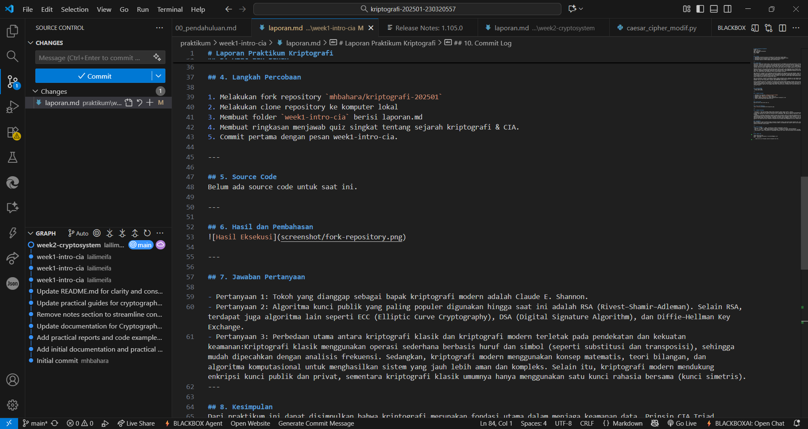

# Laporan Praktikum Kriptografi
Minggu ke-: 1  
Topik: intro_cia  
Nama: Laili Meifa Ayuningtias  
NIM: 230320557  
Kelas: 5DSRA  

---

## 1. Tujuan
1. Menjelaskan sejarah dan evolusi kriptografi dari masa klasik hingga modern.
2. Menyebutkan prinsip Confidentiality, Integrity, Availability (CIA) dengan benar.
3. Menyimpulkan peran kriptografi dalam sistem keamanan informasi modern.
4. Menyiapkan repositori GitHub sebagai media kerja praktikum.

---

## 2. Dasar Teori
Kriptografi berasal dari bahasa Yunani, yaitu crypto yang berarti “tersembunyi” dan graphy yang berarti “tulisan”. Sejak ribuan tahun lalu, kriptografi telah digunakan untuk melindungi pesan rahasia dalam komunikasi penting, terutama di bidang militer dan diplomatik. Salah satu bentuk paling awal ditemukan pada masa Mesir Kuno, di mana para juru tulis menggunakan simbol-simbol hieroglif yang diacak untuk menyembunyikan arti sebenarnya. Pada zaman Yunani dan Romawi, Julius Caesar memperkenalkan teknik sederhana yang kini dikenal sebagai Caesar Cipher, yaitu metode substitusi huruf dengan pergeseran tertentu dalam alfabet.

Memasuki abad ke-16, muncul metode yang lebih maju yaitu Vigenère Cipher, yang menggunakan kunci berbentuk kata untuk mengatur pola substitusi. Metode ini dianggap sangat aman pada masanya dan digunakan selama berabad-abad sebelum akhirnya berhasil dipecahkan pada abad ke-19. Perkembangan ini menandai berakhirnya era kriptografi klasik, yang mengandalkan manipulasi huruf dan simbol secara manual, dan menjadi dasar bagi pendekatan ilmiah terhadap keamanan informasi.

Pada abad ke-20, kriptografi mulai mengadopsi pendekatan matematis dan algoritmik yang lebih kompleks. Salah satu konsep penting adalah modular aritmetika, yaitu operasi berbasis sisa pembagian yang digunakan dalam banyak algoritma modern. Salah satu algoritma terkenal adalah RSA (Rivest–Shamir–Adleman) yang dikembangkan pada tahun 1977, menggunakan pasangan kunci publik dan kunci privat untuk mengenkripsi dan mendekripsi pesan dengan aman. Selain itu, algoritma simetris seperti AES (Advanced Encryption Standard) menjadi standar global dalam perlindungan data digital.

Pada era kontemporer, kriptografi berkembang melampaui sekadar penyandian pesan. Teknologi ini kini menjadi fondasi bagi sistem blockchain dan cryptocurrency, seperti Bitcoin, yang menggunakan fungsi hash kriptografis dan tanda tangan digital untuk memastikan keamanan, keaslian, dan transparansi transaksi tanpa memerlukan otoritas pusat.

Selain perkembangan algoritma, kriptografi juga berperan penting dalam menjaga keamanan informasi melalui prinsip CIA Triad yaitu, Confidentiality, Integrity, dan Availability. Confidentiality memastikan data hanya dapat diakses oleh pihak yang berwenang, Integrity menjaga agar data tetap utuh dan tidak dimodifikasi tanpa izin, sedangkan Availability memastikan sistem dan informasi selalu dapat diakses kapan pun oleh pengguna yang berhak. Ketiga prinsip ini menjadi pilar utama dalam desain sistem keamanan informasi modern.

---

## 3. Alat dan Bahan  
- Visual Studio Code   
- Git dan akun GitHub  

---

## 4. Langkah Percobaan

1. Melakukan fork repository `mhbahara/kriptografi-202501`
2. Melakukan clone repository ke komputer lokal
3. Membuat folder `week1-intro-cia` berisi laporan.md
4. Membuat ringkasan menjawab quiz singkat tentang sejarah kriptografi & CIA.
5. Commit pertama dengan pesan week1-intro-cia.

---

## 5. Source Code
Belum ada source code untuk saat ini.

---

## 6. Hasil dan Pembahasan


---

## 7. Jawaban Pertanyaan
  
- Pertanyaan 1: Tokoh yang dianggap sebagai bapak kriptografi modern adalah Claude E. Shannon.
- Pertanyaan 2: Algoritma kunci publik yang paling populer digunakan hingga saat ini adalah RSA (Rivest–Shamir–Adleman). Selain RSA, terdapat juga algoritma lain seperti ECC (Elliptic Curve Cryptography), DSA (Digital Signature Algorithm), dan Diffie–Hellman Key Exchange.
- Pertanyaan 3: Perbedaan utama antara kriptografi klasik dan kriptografi modern terletak pada pendekatan dan kekuatan keamanan:Kriptografi klasik menggunakan operasi sederhana berbasis huruf dan simbol (seperti substitusi dan transposisi), sehingga mudah dipecahkan dengan analisis frekuensi. Sedangkan, kriptografi modern menggunakan konsep matematis, teori bilangan, dan algoritma komputasional untuk menghasilkan sistem yang jauh lebih aman dan kompleks. Selain itu, kriptografi modern mendukung enkripsi kunci publik dan privat, sementara kriptografi klasik umumnya hanya menggunakan satu kunci rahasia bersama (kunci simetris).
---

## 8. Kesimpulan
Dari praktikum ini dapat disimpulkan bahwa kriptografi merupakan fondasi utama dalam menjaga keamanan data. Prinsip CIA Triad menjadi landasan dalam setiap sistem keamanan informasi modern, dan pemahaman dasar seperti cipher klasik membantu memahami konsep enkripsi dan dekripsi secara praktis.

---

## 9. Daftar Pustaka
- Katz, J., & Lindell, Y. (2007). Introduction to Modern Cryptography. CRC Press.
- Stallings, W. (2017). Cryptography and Network Security: Principles and Practice. Pearson Education.
- Paar, C., & Pelzl, J. (2010). Understanding Cryptography: A Textbook for Students and Practitioners. Springer.
- Tutorialspoint. (2024). Introduction to Cryptography. Diakses dari https://www.tutorialspoint.com/cryptography

---

## 10. Commit Log
```
commit week1-intro-cia
Author: Laili Meifa Ayuningtias <lailimeifa430@gmail.com>
Date:   2025-10-07

    week1-intro-cia: Meringkas sejarah kriptografi dan CIA.
```
