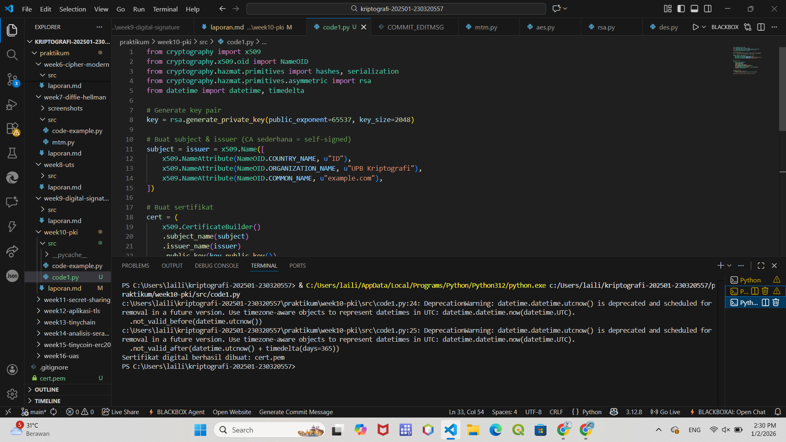

# Laporan Praktikum Kriptografi
Minggu ke-: XI
Topik: Public Key Infrastructure (PKI & Certificate Authority)

Nama: Laili Meifa Ayuningtias  
NIM: 230320557  
Kelas: 5DSRA  

---

## 1. Tujuan
1. Membuat sertifikat digital sederhana.
2. Menjelaskan peran Certificate Authority (CA) dalam sistem PKI.
3. Mengevaluasi fungsi PKI dalam komunikasi aman (contoh: HTTPS, TLS).

---

## 2. Dasar Teori
Public Key Infrastructure (PKI) adalah sistem yang mengelola penggunaan kunci publik dan privat untuk menjamin keamanan komunikasi digital, seperti enkripsi dan autentikasi. Certificate Authority (CA) berperan sebagai pihak tepercaya yang memverifikasi identitas pengguna atau server dan menerbitkan sertifikat digital, sehingga memastikan komunikasi berlangsung aman dan bebas dari pemalsuan identitas. Percobaan ini bertujuan untuk mensimulasikan proses pembuatan sertifikat digital menggunakan Python dan OpenSSL sebagai dasar penerapan keamanan berbasis Public Key Infrastructure (PKI). Melalui simulasi ini, ditunjukkan bagaimana pasangan kunci publik–privat dihasilkan, sertifikat ditandatangani, dan digunakan untuk membuktikan identitas suatu entitas dalam komunikasi digital.

Certificate Authority (CA) berperan sebagai pihak tepercaya yang bertugas memverifikasi identitas pemilik sertifikat sebelum menandatanganinya. Dengan adanya CA, pihak penerima dapat memastikan bahwa public key yang digunakan benar-benar milik pihak yang sah, sehingga mencegah pemalsuan identitas dan serangan Man-in-the-Middle.

PKI menyediakan kerangka kerja yang mengelola sertifikat digital, kunci kriptografi, dan mekanisme verifikasi kepercayaan dalam komunikasi aman. Melalui PKI, sistem seperti HTTPS, email terenkripsi, dan autentikasi jaringan dapat berjalan dengan aman karena adanya rantai kepercayaan yang dijamin oleh CA.

---

## 3. Alat dan Bahan
- Python 3.x  
- Visual Studio Code / editor lain  
- Git dan akun GitHub   
- library cryptography pyopenssl

---

## 4. Langkah Percobaan
1. Buat program simulasi pembuatan sertifikat digital dengan python atau OpenSSL.
2. Buat laporan.md dan menjawab beberapa pertanyaan.

---

## 5. Source Code

```python
from cryptography import x509
from cryptography.x509.oid import NameOID
from cryptography.hazmat.primitives import hashes, serialization
from cryptography.hazmat.primitives.asymmetric import rsa
from datetime import datetime, timedelta

# generate key pair RSA
key = rsa.generate_private_key(public_exponent=65537, key_size=2048)

# buat subjek dan issuer (CA sederhana = self-signed)
s = issuer = x509.Name([
    x509.NameAttribute(NameOID.COUNTRY_NAME, u"ID"),
    x509.NameAttribute(NameOID.ORGANIZATION_NAME, u"UPB Kriptografi"),
    x509.NameAttribute(NameOID.COMMON_NAME, u"upbKriptografi.id"),
])

# buat sertifikat
cert = (
    x509.CertificateBuilder()
    .subject_name(s)
    .issuer_name(issuer)
    .public_key(key.public_key())
    .serial_number(x509.random_serial_number())
    .not_valid_before(datetime.utcnow())
    .not_valid_after(datetime.utcnow() + timedelta(days=365))
    .sign(key, hashes.SHA256())
)

# save sertifikat ke pem file
with open("sertifikat-digital.pem", "wb") as f:
    f.write(cert.public_bytes(serialization.Encoding.PEM))

print("Sertifikat berhasil dibuat dan disimpan sebagai 'sertifikat-digital.pem'")
```
---

## 6. Hasil dan Pembahasan
Hasil eksekusi program:


---

## 7. Jawaban Pertanyaan
Pertamyaan 1: Apa fungsi utama Certificate Authority (CA)?
Certificate Authority (CA) berfungsi untuk memverifikasi identitas pihak yang berkomunikasi di dunia digital serta menerbitkan dan mengelola sertifikat digital guna menjamin keamanan dan keaslian data. CA memastikan bahwa koneksi, seperti pada HTTPS, aman dan dapat dipercaya dengan memvalidasi identitas pemilik sertifikat serta mengatur masa berlaku dan pencabutannya.
Pertanyaan 2: Mengapa self-signed certificate tidak cukup untuk sistem produksi?
Karena tidak diverifikasi oleh CA tepercaya, sehingga tidak menjamin keaslian identitas dan mudah disalahgunakan untuk serangan MITM.
Pertanyaan 3 : Bagaimana PKI mencegah serangan MITM dalam komunikasi TLS/HTTPS?
PKI mencegah serangan Man-in-the-Middle (MITM) dengan memastikan bahwa server yang dihubungi benar-benar asli melalui sertifikat digital yang diverifikasi oleh Certificate Authority (CA). Dalam proses TLS/HTTPS, klien memeriksa keabsahan sertifikat server sebelum membangun koneksi aman, sehingga penyerang tidak dapat menyamar sebagai server karena tidak memiliki private key yang sah.

---

## 8. Kesimpulan
Certificate Authority dan PKI berperan penting dalam menjamin keaslian identitas dan keamanan komunikasi digital. Dengan verifikasi sertifikat oleh CA tepercaya, sistem seperti TLS/HTTPS dapat mencegah pemalsuan identitas dan serangan Man-in-the-Middle. Percobaan ini bertujuan untuk memahami konsep Public Key Infrastructure (PKI) melalui simulasi pembuatan sertifikat digital menggunakan Python dan OpenSSL. Dalam percobaan ini ditunjukkan bagaimana pasangan kunci publik–privat dibuat, sertifikat ditandatangani oleh Certificate Authority (CA), serta peran CA dalam menjamin keaslian identitas dan keamanan komunikasi. Hasil percobaan menunjukkan bahwa PKI berfungsi sebagai fondasi keamanan komunikasi digital dengan mencegah pemalsuan identitas dan serangan Man-in-the-Middle melalui mekanisme verifikasi sertifikat yang tepercaya, sebagaimana diterapkan pada sistem seperti HTTPS.

---

## 9. Daftar Pustaka 
- Katz, J., & Lindell, Y. *Introduction to Modern Cryptography*.  
- Stallings, W. *Cryptography and Network Security*. 

---

## 10. Commit Log

```
commit week10-pki
Author: Laili Meifa Ayuningtias <lailimeifa430@gmail.com>
Date:   2025-12-18

    week2-cryptosystem: implementasi PKI dan laporan 
```