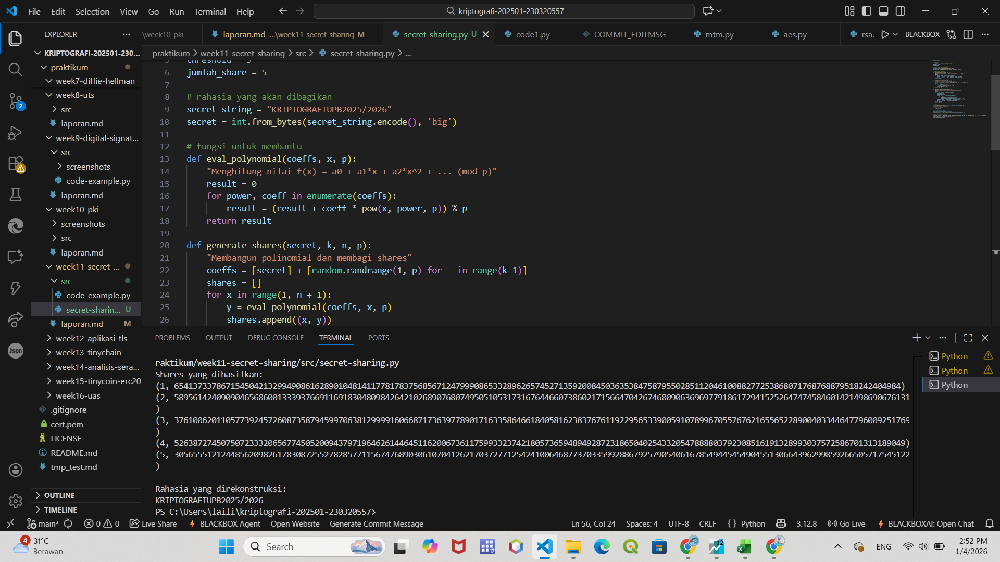

# Laporan Praktikum Kriptografi
Minggu ke-: 11  
Topik: Secret Sharing (Shamir’s Secret Sharing)  
Nama: Laili Meifa Ayunintias  
NIM: 230320557  
Kelas: 5DSRA  

---

## 1. Tujuan
1. Menjelaskan konsep Shamir Secret Sharing (SSS).
2. Melakukan simulasi pembagian rahasia ke beberapa pihak menggunakan skema SSS.
3. Menganalisis keamanan skema distribusi rahasia.

---

## 2. Dasar Teori
Shamir Secret Sharing (SSS) adalah skema kriptografi yang digunakan untuk membagi sebuah rahasia menjadi beberapa bagian (share) dan mendistribusikannya ke sejumlah pihak, sehingga rahasia tersebut hanya dapat direkonstruksi jika jumlah minimum bagian tertentu (threshold) digabungkan. Skema ini berbasis pada konsep polinomial matematika, di mana nilai rahasia disimpan sebagai konstanta dalam sebuah polinomial berderajat tertentu, lalu setiap pihak menerima satu titik pada polinomial tersebut. Rekonstruksi rahasia dilakukan menggunakan interpolasi Lagrange ketika jumlah share yang memenuhi threshold tersedia.

Dari sisi keamanan, SSS tergolong sangat kuat karena kurang dari jumlah threshold share tidak memberikan informasi apa pun tentang rahasia (perfect secrecy). Hal ini membuat skema ini tahan terhadap kebocoran sebagian data dan serangan pihak tidak berwenang. Namun, keamanan implementasinya tetap bergantung pada pemilihan parameter yang tepat, pengelolaan share yang aman, serta penggunaan bilangan acak dan operasi aritmatika pada medan hingga (finite field) yang benar agar tidak menimbulkan celah keamanan.

---

## 3. Alat dan Bahan
- Python 3.x  
- Visual Studio Code / editor lain  
- Git dan akun GitHub  
- Library secretsharing

---

## 4. Langkah Percobaan
1. pip install secretsharing
2. implementasi shamir secret sharing dengan python
3. simulasi manual dengan polinomial modulo p
4. analisis keamanan
5. menjawab pertanyaan diskusi
6. menyelesaikan laporan.md

---

## 5. Source Code

```python
import random

# parameters
p = 2**521 - 1  # A large prime number
threshold = 3
jumlah_share = 5

# rahasia yang akan dibagikan
secret_string = "KRIPTOGRAFIUPB2025/2026"
secret = int.from_bytes(secret_string.encode(), 'big')

# fungsi untuk membantu
def eval_polynomial(coeffs, x, p):
    "Menghitung nilai f(x) = a0 + a1*x + a2*x^2 + ... (mod p)"
    result = 0
    for power, coeff in enumerate(coeffs):
        result = (result + coeff * pow(x, power, p)) % p
    return result

def generate_shares(secret, k, n, p):
    "Membangun polinomial dan membagi shares"
    coeffs = [secret] + [random.randrange(1, p) for _ in range(k-1)]
    shares = []
    for x in range(1, n + 1):
        y = eval_polynomial(coeffs, x, p)
        shares.append((x, y))
    return shares

def lagrange_interpolation(shares, p):
    "Rekonstruksi secret dengan Lagrange Interpolation"
    secret = 0
    for j, (xj, yj) in enumerate(shares):
        numerator = 1
        denominator = 1
        for m, (xm, _) in enumerate(shares):
            if m != j:
                numerator = (numerator * (-xm)) % p
                denominator = (denominator * (xj - xm)) % p
        lagrange_coeff = (numerator * pow(denominator, -1, p)) % p
        secret = (secret + yj * lagrange_coeff) % p
    return secret

# proses
shares = generate_shares(secret, threshold, jumlah_share, p)
print("Shares yang dihasilkan:")
for share in shares:
    print(share)
    
# milih minimal k shares
selected_shares = shares[:threshold]
recovered_secret = lagrange_interpolation(selected_shares, p)

# konversi kembali ke string
recovered_string = recovered_secret.to_bytes((recovered_secret.bit_length() + 7) // 8, 'big').decode()
print("\nRahasia yang direkonstruksi:")
print(recovered_string)
```
---

## 6. Hasil dan Pembahasan
Hasil eksekusi program:


---

## 7. Jawaban Pertanyaan
- Pertanyaan 1: Apa keuntungan utama Shamir Secret Sharing dibanding membagikan salinan kunci secara langsung?
    Keuntungan utamanya adalah meningkatkan keamanan karena tidak ada satu pihak pun yang menyimpan kunci rahasia secara utuh. Jika satu atau beberapa pihak mengalami kebocoran data, rahasia tetap aman selama jumlah share yang bocor belum mencapai threshold. Berbeda dengan pembagian salinan kunci langsung, kebocoran pada satu pihak saja sudah cukup untuk membahayakan seluruh sistem.
- Pertanyaan 2: Apa peran threshold (k) dalam keamanan secret sharing?  
    Threshold (k) menentukan jumlah minimum share yang harus digabungkan untuk merekonstruksi rahasia. Nilai ini menjadi pengendali utama tingkat keamanan dan toleransi kesalahan: semakin besar nilai k, semakin tinggi keamanan karena lebih banyak pihak yang harus bekerja sama, namun semakin rendah fleksibilitas. Sebaliknya, nilai k yang lebih kecil meningkatkan kemudahan akses tetapi dengan risiko keamanan yang lebih tinggi.
- Pertanyaan 3: Berikan satu contoh skenario nyata di mana SSS sangat bermanfaat.
    SSS sangat bermanfaat dalam pengelolaan kunci master pada sistem perbankan atau data center, di mana kunci enkripsi dibagi kepada beberapa pejabat atau administrator. Kunci tersebut hanya dapat digunakan jika sejumlah pejabat tertentu hadir dan menyatukan share mereka, sehingga mencegah penyalahgunaan kunci oleh satu orang saja.

---

## 8. Kesimpulan
Berdasarkan percobaan yang dilakukan, Shamir Secret Sharing terbukti mampu membagi dan merekonstruksi rahasia dengan aman menggunakan mekanisme threshold, di mana rahasia hanya dapat diperoleh jika jumlah share minimum terpenuhi. Implementasi menggunakan polinomial modulo bilangan prima menunjukkan bahwa skema ini memberikan keamanan yang kuat karena kurang dari threshold share tidak mengungkapkan informasi apa pun tentang rahasia. Dengan demikian, SSS sangat efektif untuk meningkatkan keamanan distribusi kunci dan mencegah penyalahgunaan oleh satu pihak.

---

## 9. Daftar Pustaka
- Katz, J., & Lindell, Y. *Introduction to Modern Cryptography*.  
- Stallings, W. *Cryptography and Network Security*. 

---

## 10. Commit Log
```
commit week11-secret-sharing
Author: Laili Meifa Ayuningtias <lailimeifa430@gamil.com>
Date:   2025-12-20

    week11-secret-sharing: implementasi Shamir Secret Sharing dan laporan 
```
