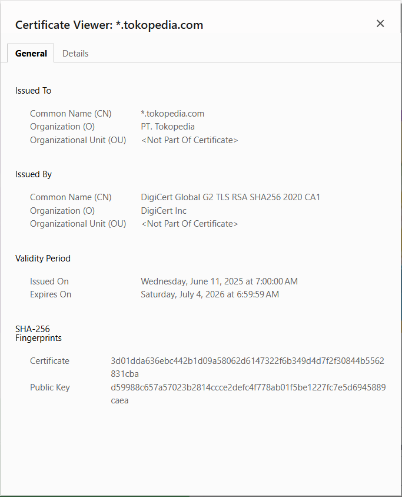

# Laporan Praktikum Kriptografi
Minggu ke-: 12  
Topik: Aplikasi TLS & E-commerce  
Nama: Laili Meifa Ayuningtias  
NIM: 230320557  
Kelas: 5DSRA  

---

## 1. Tujuan
1. Menganalisis penggunaan kriptografi pada email dan SSL/TLS.
2. Menjelaskan enkripsi dalam transaksi e-commerce.
3. Mengevaluasi isu etika & privasi dalam penggunaan kriptografi di kehidupan sehari-hari.

---

## 2. Dasar Teori
Kriptografi pada email dan SSL/TLS digunakan untuk menjaga kerahasiaan, integritas, dan autentikasi data selama proses komunikasi. Pada email, teknologi seperti PGP dan S/MIME menerapkan enkripsi kunci publik agar hanya penerima yang berhak dapat membaca isi pesan, sekaligus menjamin keaslian pengirim melalui tanda tangan digital. Sementara itu, SSL/TLS mengamankan komunikasi antara klien dan server di internet dengan mengenkripsi data yang dikirim, mencegah penyadapan dan serangan man-in-the-middle.

Dalam transaksi e-commerce, enkripsi berperan penting untuk melindungi data sensitif seperti informasi kartu kredit, identitas pengguna, dan detail transaksi. Protokol HTTPS (berbasis SSL/TLS) memastikan data yang dikirim antara pengguna dan server tidak dapat dibaca atau diubah oleh pihak lain. Selain itu, penggunaan kriptografi juga mendukung mekanisme autentikasi dan non-repudiation, sehingga meningkatkan kepercayaan antara penjual dan pembeli dalam transaksi daring.

Dari sisi etika dan privasi, kriptografi membantu melindungi hak privasi individu dengan menjaga data pribadi dari akses tidak sah. Namun, muncul isu etika ketika enkripsi kuat digunakan untuk menyembunyikan aktivitas ilegal atau ketika pemerintah dan organisasi berusaha membatasi atau mengakses data terenkripsi. Oleh karena itu, penggunaan kriptografi perlu diimbangi dengan kebijakan yang adil dan bertanggung jawab agar keamanan, privasi, dan kepentingan publik tetap seimbang.

---

## 3. Alat dan Bahan
- Python 3.x  
- Visual Studio Code / editor lain  
- Git dan akun GitHub  
- Library tambahan (misalnya pycryptodome, jika diperlukan) 

---

## 4. Langkah Percobaan
1. Laporan studi kasus tentang penerapan SSL/TLS pada email dan e-commerce.
2. Analisis isu privasi dan etika penggunaan kriptografi.
3. Commit Git dengan format week12-aplikasi-tls.

---

## 5. Source Code
```tidak ada
```

---

## 6. Hasil dan Pembahasan


### Langkah 1
Berdasarkan hasil pengecekan sertifikat digital pada website Tokopedia melalui browser, diketahui bahwa Tokopedia telah menggunakan sertifikat keamanan berbasis HTTPS yang valid dan terpercaya. Sertifikat ini digunakan untuk menjamin keamanan pertukaran data antara pengguna dan server, terutama dalam aktivitas sensitif seperti login dan transaksi online.

- Issuer CA (Certificate Authority):
Sertifikat Tokopedia diterbitkan oleh DigiCert Inc, dengan Common Name DigiCert Global G2 TLS RSA SHA256 2020 CA1. DigiCert merupakan salah satu Certificate Authority global yang terpercaya dan diakui oleh browser modern.
- Masa Berlaku Sertifikat:
Sertifikat mulai berlaku pada 11 Juni 2025 dan akan berakhir pada 4 Juli 2026, dengan masa berlaku sekitar 1 tahun, sesuai dengan standar keamanan TLS saat ini.
- Algoritma Enkripsi yang Digunakan:
Sertifikat menggunakan algoritma RSA sebagai algoritma kunci publik dan SHA-256 sebagai algoritma hash untuk tanda tangan digital. Dalam proses komunikasi HTTPS, data pengguna dienkripsi menggunakan protokol TLS dengan algoritma enkripsi simetris seperti AES, sehingga data tetap aman selama proses pengiriman.

Website yang menggunakan HTTPS memiliki tingkat keamanan yang jauh lebih baik dibandingkan website yang masih menggunakan HTTP. HTTPS menggunakan sertifikat digital dan enkripsi data sehingga informasi yang dikirimkan oleh pengguna tidak dapat dengan mudah disadap atau dimanipulasi oleh pihak lain. Sebaliknya, website tanpa HTTPS tidak memiliki perlindungan enkripsi sehingga sangat berisiko, terutama untuk website yang menangani data sensitif.

### Langkah 2
Enkripsi melindungi transaksi online dengan mengamankan data yang dikirim antara pengguna dan server menggunakan protokol TLS. Saat login atau pembayaran, data sensitif dienkripsi sehingga tidak dapat dibaca oleh pihak lain meskipun disadap. TLS memastikan kerahasiaan dan keamanan informasi pengguna selama proses transaksi. Jika TLS tidak digunakan, data dikirim dalam bentuk terbuka dan rentan terhadap serangan Man-in-the-Middle, di mana penyerang dapat mencuri atau memanipulasi informasi seperti username, password, dan data pembayaran. Hal ini dapat menyebabkan pencurian akun dan kerugian finansial.

### Langkah 3
Penggunaan email terenkripsi seperti PGP dan S/MIME meningkatkan privasi karena isi pesan hanya dapat dibaca oleh pengirim dan penerima, namun tetap menimbulkan isu privasi terkait pengelolaan kunci dan metadata email yang masih dapat dilacak. Secara etika, perusahaan berada dalam dilema antara menjaga privasi karyawan dan kebutuhan audit keamanan; dekripsi email karyawan untuk audit dapat dibenarkan jika diatur jelas dalam kebijakan internal dan dilakukan secara terbatas, transparan, serta proporsional. Di sisi lain, kebijakan pemerintah dalam pengawasan komunikasi terenkripsi juga memunculkan dilema serupa, karena upaya penegakan hukum dan keamanan nasional sering berbenturan dengan hak privasi individu, sehingga diperlukan regulasi yang seimbang agar pengawasan tidak melanggar kebebasan dan kerahasiaan komunikasi.
---

## 7. Jawaban Pertanyaan
Jawab pertanyaan diskusi yang diberikan pada modul.  
- Pertanyaan 1: Apa perbedaan utama antara HTTP dan HTTPS?
    HTTP mengirimkan data tanpa enkripsi sehingga mudah disadap, sedangkan HTTPS menggunakan enkripsi TLS untuk mengamankan data agar tidak dapat dibaca atau dimodifikasi oleh pihak lain.
- Pertanyaan 2: Mengapa sertifikat digital menjadi penting dalam komunikasi TLS?
    Sertifikat digital berfungsi untuk memverifikasi identitas website dan membangun koneksi yang aman, sehingga pengguna yakin bahwa mereka berkomunikasi dengan server yang sah dan bukan pihak palsu.
- Pertanyaan 3: Bagaimana kriptografi mendukung privasi dalam komunikasi digital, tetapi sekaligus menimbulkan tantangan hukum dan etika?
    Kriptografi melindungi privasi dengan mengenkripsi data agar hanya pihak berwenang yang dapat membacanya, namun juga menimbulkan tantangan hukum dan etika karena dapat menghambat pengawasan hukum dan memicu konflik antara keamanan, privasi, dan kepentingan publik.

---

## 8. Kesimpulan
**Kesimpulan:**
Berdasarkan percobaan dan analisis yang dilakukan, kriptografi terbukti berperan penting dalam menjaga keamanan komunikasi digital, baik pada email maupun transaksi e-commerce melalui penerapan SSL/TLS dan enkripsi data. Penggunaan HTTPS dan sertifikat digital mampu melindungi data sensitif dari penyadapan dan serangan pihak tidak berwenang. Namun, penerapan kriptografi juga menimbulkan tantangan etika dan hukum, sehingga diperlukan kebijakan yang seimbang antara perlindungan privasi, keamanan, dan kepentingan publik.


---

## 9. Daftar Pustaka
- Katz, J., & Lindell, Y. *Introduction to Modern Cryptography*.  
- Stallings, W. *Cryptography and Network Security*. 

---

## 10. Commit Log
```
commit week12-aplikasi-tls
Author: Laili Meifa Ayuningtias <lailimeifa430@gmail.com>
Date:   2026-01-04

    week12-apliaksi-tls: implementasi Aplikasi TLS & E-commerce Tokopedia dan laporan md 
```
