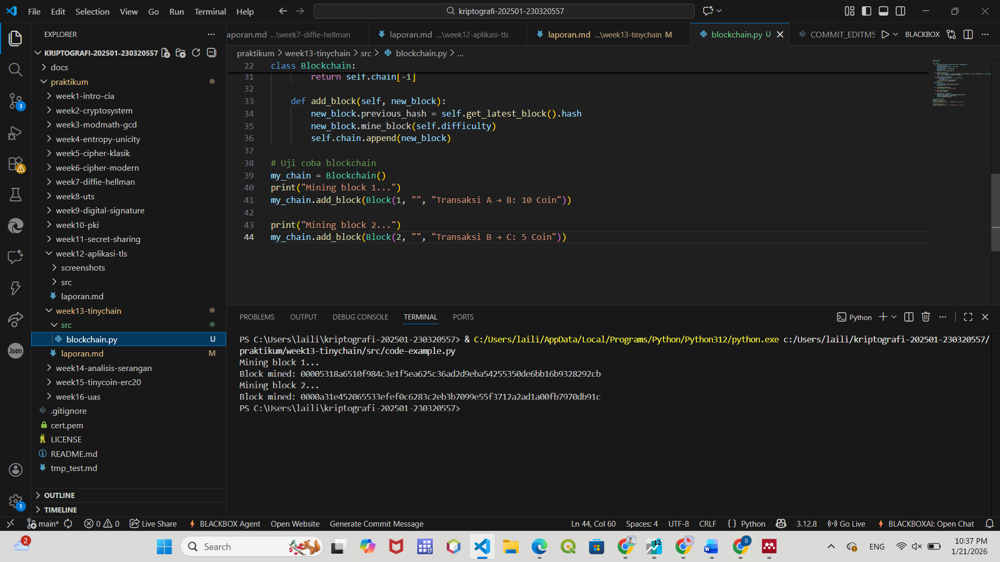

# Laporan Praktikum Kriptografi
Minggu ke-: 13  
Topik: TinyChain – Proof of Work (PoW) 
Nama: Laili Meifa Ayuningtias  
NIM: 230320557  
Kelas: 5DSRA  

---

## 1. Tujuan
1. Menjelaskan peran hash function dalam blockchain.
2. Melakukan simulasi sederhana Proof of Work (PoW).
3. Menganalisis keamanan cryptocurrency berbasis kriptografi.

---

## 2. Dasar Teori
Blockchain merupakan sistem pencatatan terdistribusi yang dirancang untuk menjamin keamanan data melalui kriptografi, konsensus, dan desentralisasi. Setiap blok berisi kumpulan transaksi yang dihubungkan dengan blok sebelumnya menggunakan hash kriptografis, sehingga perubahan pada satu blok akan memengaruhi seluruh rantai. Mekanisme ini membuat data pada blockchain bersifat transparan, sulit diubah (immutable), dan tahan terhadap manipulasi, karena salinan data tersebar di banyak node dalam jaringan.

Proof of Work (PoW) adalah salah satu mekanisme konsensus yang digunakan untuk menjaga keamanan blockchain. Dalam PoW, node (penambang) harus menyelesaikan perhitungan kriptografis yang kompleks untuk memvalidasi transaksi dan menambahkan blok baru ke blockchain. Proses ini membutuhkan sumber daya komputasi yang besar, sehingga membuat serangan seperti pemalsuan transaksi atau pengubahan data menjadi sangat mahal dan tidak efisien bagi penyerang.

Keamanan blockchain dengan PoW terletak pada prinsip bahwa mayoritas kekuatan komputasi jaringan harus jujur. Selama sebagian besar penambang mengikuti aturan, jaringan akan tetap aman dari serangan, termasuk serangan 51%. Meskipun PoW terbukti kuat dalam menjaga keamanan, mekanisme ini memiliki kelemahan seperti konsumsi energi yang tinggi, sehingga mendorong pengembangan mekanisme konsensus alternatif yang lebih efisien.

---

## 3. Alat dan Bahan
- Python 3.11  
- Visual Studio Code  
- Git dan akun GitHub  
- Library tambahan (misalnya pycryptodome, jika diperlukan)  

---

## 4. Langkah Percobaan
1. Membuat file `blockchain` di folder `praktikum/week13-tinychain/src/`.
2. Menyalin kode program dari panduan praktikum.
3. Menjalankan program dengan perintah `python blokchain.py`.)

---

## 5. Source Code
Struktur Blok dan Blokchain
```python
import hashlib
import time

class Block:
    def __init__(self, index, previous_hash, data, timestamp=None):
        self.index = index
        self.timestamp = timestamp or time.time()
        self.data = data
        self.previous_hash = previous_hash
        self.nonce = 0
        self.hash = self.calculate_hash()

    def calculate_hash(self):
        value = str(self.index) + str(self.timestamp) + str(self.data) + str(self.previous_hash) + str(self.nonce)
        return hashlib.sha256(value.encode()).hexdigest()

    def mine_block(self, difficulty):
        while self.hash[:difficulty] != "0" * difficulty:
            self.nonce += 1
            self.hash = self.calculate_hash()
        print(f"Block mined: {self.hash}")
class Blockchain:
    def __init__(self):
        self.chain = [self.create_genesis_block()]
        self.difficulty = 4

    def create_genesis_block(self):
        return Block(0, "0", "Genesis Block")

    def get_latest_block(self):
        return self.chain[-1]

    def add_block(self, new_block):
        new_block.previous_hash = self.get_latest_block().hash
        new_block.mine_block(self.difficulty)
        self.chain.append(new_block)

# Uji coba blockchain
my_chain = Blockchain()
print("Mining block 1...")
my_chain.add_block(Block(1, "", "Transaksi A → B: 10 Coin"))

print("Mining block 2...")
my_chain.add_block(Block(2, "", "Transaksi B → C: 5 Coin"))
```


---

## 6. Hasil dan Pembahasan
Hasil eksekusi program Caesar Cipher:


Langkah 3 — Analisis Proof of Work

Pada kode di atas, Proof of Work (PoW) diterapkan melalui proses mining pada fungsi mine_block(), di mana sistem mencari nilai nonce yang menghasilkan hash dengan jumlah nol di depan sesuai tingkat difficulty. Proses ini membutuhkan banyak percobaan (trial and error) dan waktu komputasi, sehingga semakin tinggi nilai difficulty, semakin lama waktu yang dibutuhkan untuk menemukan hash yang valid.

Mekanisme ini menjamin keamanan blockchain karena setiap upaya untuk mengubah data pada satu blok akan mengharuskan penyerang menambang ulang blok tersebut beserta seluruh blok setelahnya dengan difficulty yang sama. Hal ini memerlukan sumber daya komputasi yang sangat besar dan waktu yang lama, sehingga secara praktis menjadi tidak efisien dan mahal untuk dilakukan.

Dengan demikian, Proof of Work menciptakan penghalang ekonomi dan teknis bagi pihak yang ingin memanipulasi data. Selama mayoritas kekuatan komputasi berada pada node yang jujur, blockchain akan tetap aman dan integritas data di dalamnya dapat terjaga.
---

## 7. Jawaban Pertanyaan 
- Pertanyaan 1: Mengapa fungsi hash sangat penting dalam blockchain?
Fungsi hash menjaga integritas dan keamanan data karena perubahan kecil pada data akan menghasilkan hash yang sangat berbeda, sehingga manipulasi mudah terdeteksi.
- Pertanyaan 2: Bagaimana Proof of Work mencegah double spending?
Proof of Work memastikan setiap transaksi divalidasi dan dicatat dalam satu blok yang disepakati jaringan, sehingga transaksi yang sama tidak dapat digunakan lebih dari sekali.
- Pertanyaan 3: Apa kelemahan dari PoW dalam hal efisiensi energi?
PoW membutuhkan daya komputasi dan konsumsi energi yang sangat besar karena proses mining yang kompleks dan berulang.
---

## 8. Kesimpulan
Berdasarkan percobaan yang dilakukan, blockchain dapat dibangun dengan memanfaatkan fungsi hash dan mekanisme Proof of Work untuk menjaga integritas serta keamanan data. Proses mining pada PoW menunjukkan bahwa semakin tinggi tingkat kesulitan, semakin besar sumber daya komputasi yang dibutuhkan, sehingga manipulasi data menjadi tidak efisien. Dengan demikian, kriptografi dan PoW berperan penting dalam menjamin keamanan transaksi pada cryptocurrency.

---

## 9. Daftar Pustaka
- Katz, J., & Lindell, Y. *Introduction to Modern Cryptography*.  
- Stallings, W. *Cryptography and Network Security*.  

---

## 10. Commit Log
```
commit week13-tinychain
Author: Laili Meifa Ayuningtias <lailimeifa430@gmail.com>
Date:   2025-09-20

    week13-tinychain: implementasi TinyChain Proof of Work (PoW) dan laporan
```
