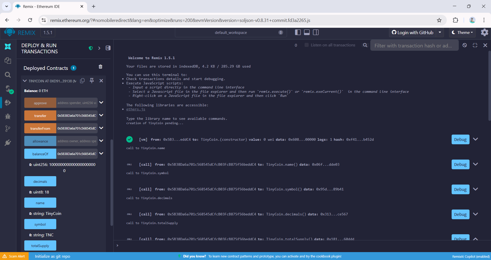

# Laporan Praktikum Kriptografi
Minggu ke-: 15  
Topik: Proyek Kelompok - TinyCoin ERC20
Nama: Laili Meifa Ayuningtias  
NIM: 230320557  
Kelas: 5DSRA  

---

## 1. Tujuan
1. Mengembangkan proyek sederhana berbasis algoritma kriptografi.
2. Mendokumentasikan proses implementasi proyek ke dalam repository Git.
3. Menyusun laporan teknis hasil proyek akhir.

---

## 2. Dasar Teori
Smart contract ERC-20 adalah standar kontrak pintar pada blockchain Ethereum yang digunakan untuk membuat dan mengelola token digital yang dapat dipertukarkan (fungible token). Standar ini mendefinisikan seperangkat fungsi dan event wajib seperti totalSupply, balanceOf, transfer, approve, dan transferFrom, sehingga token yang dibuat dapat berinteraksi secara konsisten dengan wallet, exchange, dan aplikasi terdesentralisasi (dApp). Dengan mengikuti standar ERC-20, pengembang dapat memastikan kompatibilitas token di ekosistem Ethereum.

TinyCoin sebagai token ERC-20 diimplementasikan menggunakan bahasa pemrograman Solidity, yang dirancang khusus untuk menulis smart contract pada Ethereum Virtual Machine (EVM). Smart contract ini menyimpan aturan kepemilikan dan transfer token secara otomatis tanpa perantara, sehingga transaksi bersifat transparan dan tidak dapat diubah. Setiap interaksi dengan kontrak akan divalidasi oleh jaringan blockchain, menjamin keamanan dan keandalan sistem.

Keamanan smart contract ERC-20 sangat bergantung pada penulisan kode yang benar dan penggunaan praktik terbaik, seperti pemeriksaan saldo sebelum transfer dan pembatasan akses fungsi tertentu. Meskipun ERC-20 memudahkan pembuatan token, kesalahan logika atau celah keamanan dalam smart contract dapat dimanfaatkan oleh penyerang. Oleh karena itu, pengujian dan audit kode menjadi langkah penting sebelum smart contract seperti TinyCoin digunakan secara luas.

---

## 3. Alat dan Bahan
- Python 3.11  
- Visual Studio Code
- Git dan akun GitHub  
- Library tambahan

---

## 4. Langkah Percobaan
1. Membuat file `TinyCoin` di folder `praktikum/week15-tinycoin-erc20/`
2. Menyalin kode program dari panduan praktikum.
3. Menjalankan program dengan perintah sesuai contoh
4. Membuat laporan.md

---

## 5. Source Code

```python
// SPDX-License-Identifier: MIT
pragma solidity ^0.8.0

import "@openzeppelin/contracts/token/ERC20/ERC20.sol";

contract TinyCoin is ERC20 {
    constructor(uint256 initialSupply) ERC20("TinyCoin", "TNC") {
        _mint(msg.sender, initialSupply);
    }
}
```

---

## 6. Hasil dan Pembahasan
Smart contract TinyCoin berhasil dikembangkan, dikompilasi, dan dideploy menggunakan Remix IDE pada JavaScript VM tanpa error, yang menandakan bahwa kontrak ERC-20 telah sesuai standar. Pengujian fungsi balanceOf(address) menunjukkan saldo awal token dialokasikan dengan benar kepada pemilik kontrak. Selanjutnya, fungsi transfer(address, amount) berhasil memindahkan token antar alamat dengan perubahan saldo yang sesuai. Hasil pengujian totalSupply() menunjukkan nilai total supply tetap konsisten setelah transaksi, sehingga membuktikan bahwa mekanisme transfer berjalan dengan baik dan tidak menimbulkan token secara tidak sah.

Hasil eksekusi KOntrak ERC20:


---

## 7. Jawaban Pertanyaan 
- Pertanyaan 1: Apa fungsi utama ERC20 dalam ekosistem blockchain?
ERC20 berfungsi sebagai standar untuk pembuatan token yang dapat saling kompatibel, sehingga mudah digunakan pada wallet, exchange, dan aplikasi terdesentralisasi.  
- Pertanyaan 2: Bagaimana mekanisme transfer token bekerja dalam kontrak ERC20?
Transfer token dilakukan dengan mengurangi saldo pengirim dan menambah saldo penerima sesuai jumlah token, kemudian transaksi dicatat di blockchain melalui smart contract. 
- Pertanyaan 3: Apa risiko utama dalam implementasi smart contract dan bagaimana cara mitigasinya?
Risiko utama adalah bug atau celah keamanan pada kode, yang dapat dimitigasi dengan pengujian menyeluruh, audit smart contract, dan penggunaan library standar yang tepercaya. 

---

## 8. Kesimpulan
Berdasarkan tahapan deployment dan pengujian TinyCoin berbasis ERC-20, dapat disimpulkan bahwa smart contract berhasil dikompilasi dan dideploy ke jaringan Ethereum tanpa kendala. Hasil pengujian menunjukkan fungsi balanceOf dan transfer berjalan sesuai dengan standar ERC-20, serta total supply tetap konsisten setelah transaksi dilakukan. Hal ini menunjukkan bahwa kontrak TinyCoin telah diimplementasikan dengan baik dan mampu menjaga integritas serta keandalan token dalam ekosistem blockchain.

---

## 9. Daftar Pustaka  
- Katz, J., & Lindell, Y. *Introduction to Modern Cryptography*.  
- Stallings, W. *Cryptography and Network Security*.  

---

## 10. Commit Log
```
commit week15-tinycoin-erc20
Author: Laili Meifa Ayuningtias <lailimeifa430@gmail.com>
Date:   2026-01-22

    week15-tinycoin-erc20: Implementasi smart contract ERC20 (TinyCoin) dan laporan 
```
