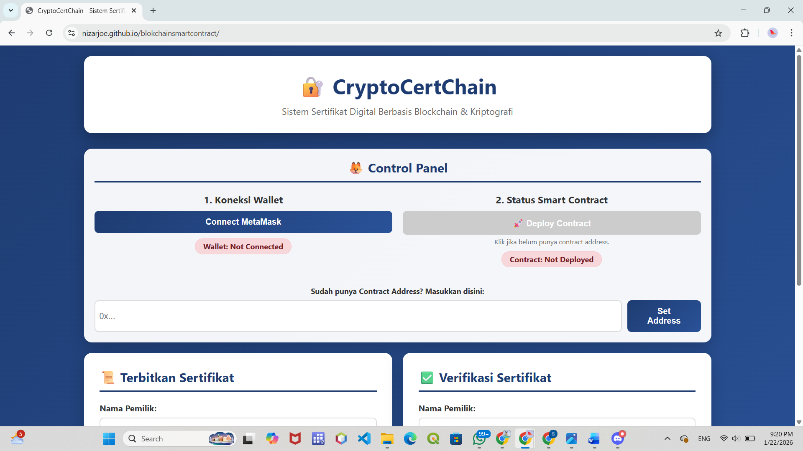
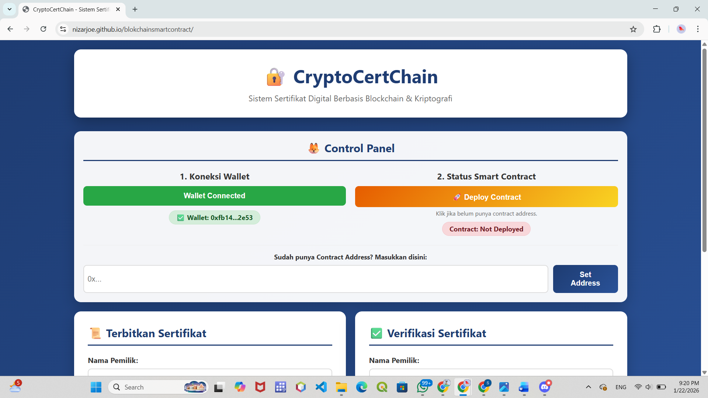
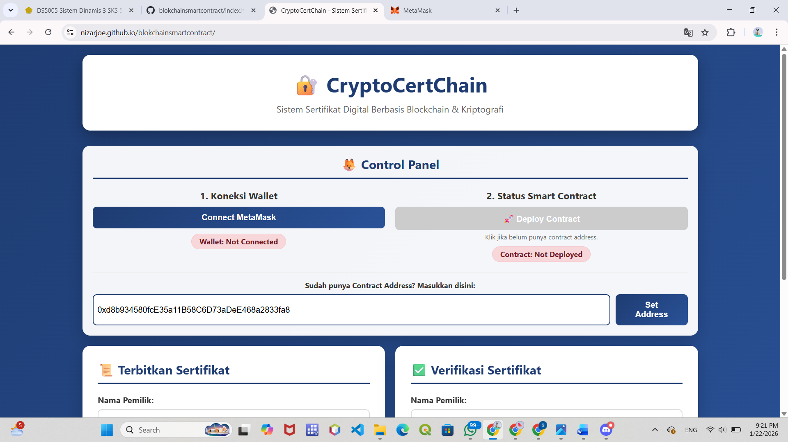
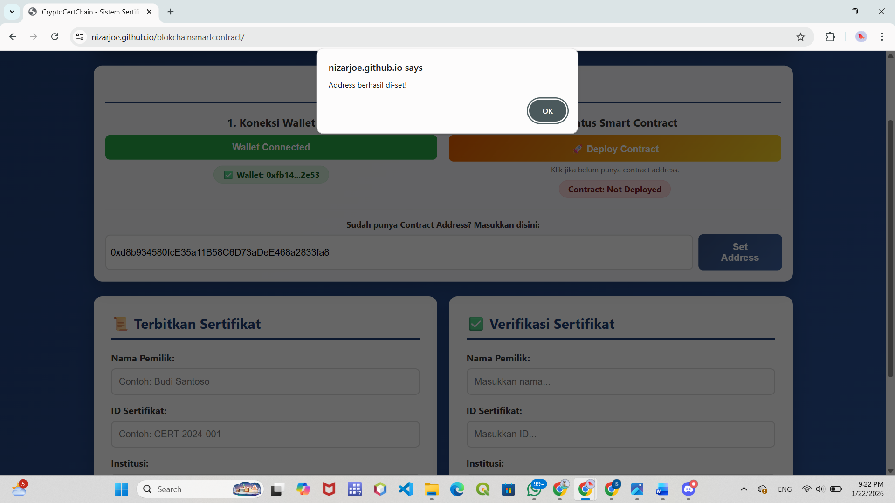
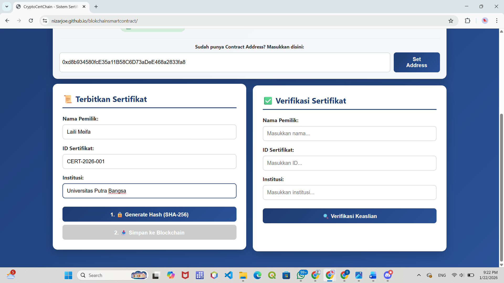
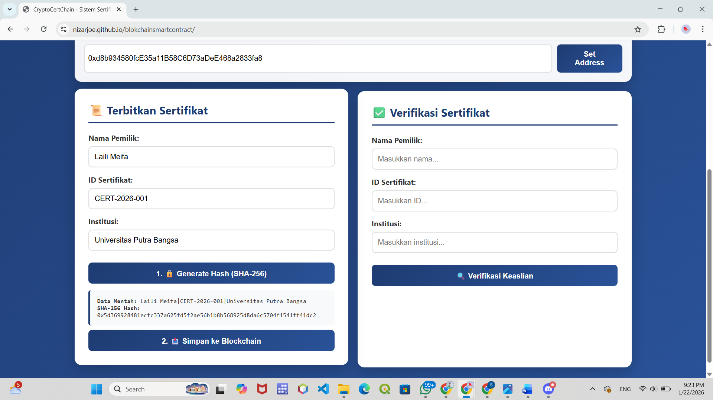
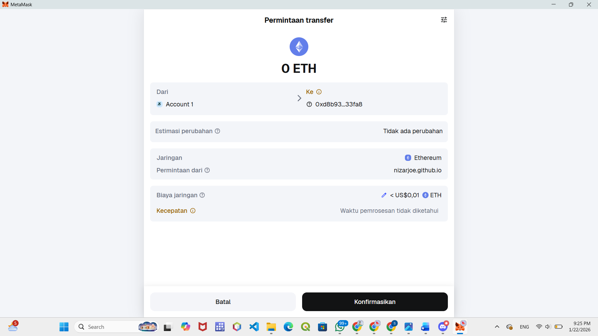
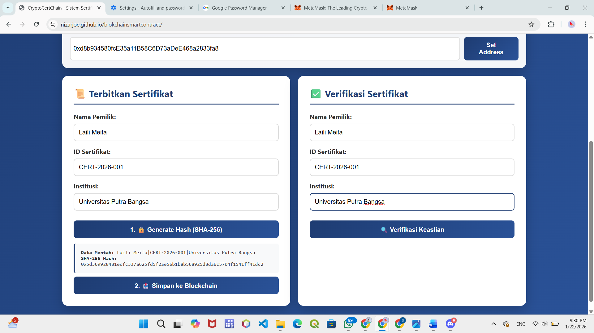

# Laporan Praktikum Kriptografi
Minggu ke-: 16  
Topik: UAS  
Nama: Laili Meifa Ayuningtias  
NIM: 230320557 
Kelas: 5DSRA  

---

## 1. Tujuan
1. Memahami konsep dasar blockchain, transaksi kripto, dan smart contract.
2. Menyediakan simulasi mining token secara manual maupun otomatis agar pengguna memahami mekanisme perolehan token.
3. Penerapan smart contract ERC-20 serta interaksi dengan dompet digital seperti MetaMask


---

## 2. Dasar Teori
Perkembangan Blockchain dan Web3 muncul sebagai solusi atas kelemahan sistem digital terpusat yang rawan manipulasi dan bergantung pada pihak ketiga. Blockchain menawarkan pencatatan data yang aman dan transparan, sementara Web3 mendukung kepemilikan data serta aset digital secara terdesentralisasi. Teknologi ini melahirkan inovasi seperti DeFi dan NFT yang berpotensi meningkatkan kepercayaan, efisiensi, dan inklusi digital, meskipun masih menghadapi tantangan dalam regulasi dan adopsi.

---

## 3. Alat dan Bahan  
- Visual Studio Code 
- Git dan akun GitHub  
- Akun Metamask
- Front End menggunakan HTML, JavaScript
- Blockchain 
- Smart Contract
- Ethereum Sepolia

---

## 4. Langkah Percobaan
1. Membuka Aplikasi CryptoCertChain

2. Menghubungkan Wallet MetaMask

3.	Memasukkan Contract Address

4.	Mengisi Data Sertifikat
Pada menu Terbitkan Sertifikat, pengguna 

5.	Generate Hash Sertifikat (SHA-256)

6.	Menyimpan Hash ke Blockchain

7.	Proses Verifikasi Sertifikat

8.	Hasil Demo

---

## 6. Hasil dan Pembahasan

Akses Aplikasi CryptoCertChain
1. Buka browser.
2. Akses alamat website CryptoCertChain.
3. Pastikan MetaMask sudah aktif dan terhubung ke browser.
4. Hubungkan MetaMask dengan aplikasi saat diminta.
Panduan Penggunaan Sistem
Menghubungkan Smart Contract
1. Masukkan Contract Address pada kolom yang tersedia.
2. Klik tombol Set Address.
3. Sistem akan terhubung dengan smart contract yang telah di-deploy.
Menerbitkan Sertifikat
Langkah-langkah:
1. Buka menu Terbitkan Sertifikat.
2. Isi data berikut:
    - Nama Pemilik
    - ID Sertifikat
    - Institusi
3. Klik tombol Generate Hash (SHA-256).
4. Sistem akan menghasilkan hash unik dari data sertifikat.
5. Klik tombol Simpan ke Blockchain.
6. MetaMask akan muncul untuk konfirmasi transaksi.
7. Klik Confirm pada MetaMask.
8. Tunggu hingga transaksi berhasil diproses.

---

## 7. Kesimpulan
Sistem ini mampu menerapkan konsep Web3 secara efektif dan menunjukkan potensi besar untuk dikembangkan di berbagai sektor melalui peningkatan efisiensi, kepercayaan, serta kepemilikan aset digital oleh pengguna. Meskipun masih menghadapi tantangan terkait regulasi dan tingkat adopsi, koin ini dinilai memiliki prospek yang kuat sebagai dasar pengembangan ekosistem digital di masa depan.

---

## 8. Commit Log
```
commit week-16-uas
Author: Laili Meifa Ayuningtias <lailimeifa430@gmail.com>
Date:   2026-01-27

    week16-uas: demonstrasi dan laporan proyek
```
