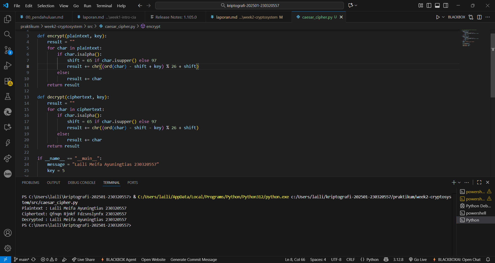

# Laporan Praktikum Kriptografi
Minggu ke-: 2  
Topik: Cryptosystem  
Nama: Laili Meifa Ayuningtias  
NIM: 230320557  
Kelas: 5DSRA  

---

## 1. Tujuan
1. Mengidentifikasi komponen dasar kriptosistem (plaintext, ciphertext, kunci, algoritma).
2. Menggambarkan proses enkripsi dan dekripsi sederhana.
3. Mengklasifikasikan jenis kriptosistem (simetris dan asimetris).
---

## 2. Dasar Teori
Cipher klasik merupakan teknik penyandian pesan yang digunakan sejak masa kuno untuk menjaga kerahasiaan komunikasi. Teknik ini bekerja dengan mengubah bentuk teks asli (plaintext) menjadi teks tersandi (ciphertext) menggunakan aturan tertentu. Terdapat dua jenis utama cipher klasik, yaitu substitution cipher yang mengganti setiap huruf dengan huruf lain, dan transposition cipher yang mengubah urutan huruf dalam pesan. Salah satu contoh paling terkenal adalah Caesar Cipher, di mana huruf-huruf digeser beberapa langkah dalam alfabet. Metode ini sederhana namun efektif pada masanya untuk melindungi informasi rahasia dari pihak yang tidak berwenang.

Dalam penerapannya, cipher klasik banyak melibatkan konsep matematika dasar seperti aritmetika modular, yang digunakan untuk menentukan pola penggantian atau pergeseran huruf. Konsep ini memungkinkan proses penyandian dan pembacaan ulang pesan dilakukan secara sistematis dan konsisten. Selain itu, keamanan cipher klasik bergantung pada kerahasiaan kunci enkripsi yang digunakan. Apabila kunci diketahui, pesan dapat dengan mudah dikembalikan ke bentuk aslinya.

Meskipun cipher klasik kini tidak lagi dianggap aman karena dapat dipecahkan menggunakan analisis pola huruf atau kekuatan komputasi modern, metode ini tetap penting sebagai dasar dalam mempelajari kriptografi. Cipher klasik memperkenalkan prinsip-prinsip utama dalam keamanan data seperti kerahasiaan, integritas, dan autentikasi yang kemudian dikembangkan dalam sistem kriptografi modern berbasis komputer.
---

## 3. Alat dan Bahan
- Python 3.x  
- Visual Studio Code / editor lain  
- Git dan akun GitHub  
- Library tambahan (misalnya pycryptodome, jika diperlukan) 
---

## 4. Langkah Percobaan

1. Membuat file `caesar_cipher.py` di folder `praktikum/week2-cryptosystem/src/`.
2. Menyalin kode program dari panduan praktikum.
3. Menjalankan program dengan perintah `python caesar_cipher.py`.
4. Membuat code modifikasi agar angka bisa dienkripsi pada file `python caesar_cipher_modif.py`
---

## 5. Source Code
```python
# file: praktikum/week2-cryptosystem/src/simple_crypto.py

def encrypt(plaintext, key):
    result = ""
    for char in plaintext:
        if char.isalpha():
            shift = 65 if char.isupper() else 97
            result += chr((ord(char) - shift + key) % 26 + shift)
        else:
            result += char
    return result

def decrypt(ciphertext, key):
    result = ""
    for char in ciphertext:
        if char.isalpha():
            shift = 65 if char.isupper() else 97
            result += chr((ord(char) - shift - key) % 26 + shift)
        else:
            result += char
    return result

if __name__ == "__main__":
    message = "Laili Meifa Ayuningtias 230320557"
    key = 5

    enc = encrypt(message, key)
    dec = decrypt(enc, key)

    print("Plaintext :", message)
    print("Ciphertext:", enc)
    print("Decrypted :", dec)
```
---

## 6. Hasil dan Pembahasan
Hasil eksekusi program Caesar Cipher:




---

## 7. Jawaban Pertanyaan

- Pertanyaan 1: Komponen utama dalam sebuah kriptosistem terdiri dari:
Plaintext → pesan asli yang ingin dilindungi.
Ciphertext → hasil penyandian atau pesan yang sudah terenkripsi.
Algoritma enkripsi dan dekripsi → aturan atau metode yang digunakan untuk mengubah plaintext menjadi ciphertext dan sebaliknya.
Kunci (key) → nilai rahasia yang digunakan oleh algoritma untuk melakukan proses enkripsi maupun dekripsi.
Proses enkripsi dan dekripsi → tahapan untuk mengubah data asli menjadi tersandi dan mengembalikannya ke bentuk semula. 

- Pertanyaan 2: Kriptosistem simetris memiliki beberapa kelebihan dibandingkan sistem asimetris. Sistem ini menggunakan satu kunci yang sama untuk proses enkripsi dan dekripsi, sehingga prosesnya lebih cepat dan efisien, terutama untuk mengenkripsi data dalam jumlah besar. Selain itu, algoritma simetris relatif sederhana dan membutuhkan sumber daya komputasi yang lebih ringan. Namun, sistem simetris juga memiliki kelemahan yang cukup signifikan. Masalah utama terletak pada proses distribusi kunci, karena pengirim dan penerima harus memiliki kunci yang sama dan menjaganya tetap rahasia. Sistem ini juga kurang cocok untuk komunikasi skala besar, sebab setiap pasangan pengguna memerlukan kunci yang berbeda. Jika kunci sampai bocor, maka seluruh pesan yang dienkripsi dengan kunci tersebut dapat dengan mudah dibaca oleh pihak yang tidak berwenang.

- Pertanyaan 3: Distribusi kunci menjadi masalah utama karena pengirim dan penerima harus berbagi kunci rahasia yang sama sebelum komunikasi dimulai. Jika proses pengiriman kunci dilakukan melalui saluran yang tidak aman, maka kunci dapat dicuri atau disadap oleh pihak ketiga, sehingga seluruh sistem menjadi tidak aman. Tantangan terbesar adalah bagaimana mengirimkan kunci dengan aman tanpa pihak lain dapat mengetahuinya — inilah sebabnya kriptografi asimetris (dengan kunci publik dan privat) kemudian dikembangkan untuk mengatasi masalah ini.
---

## Klasifikasi Simetris & Asimetris
1. Kriptografi Simetris
Kriptografi simetris adalah sistem enkripsi yang menggunakan kunci yang sama untuk proses enkripsi (pengubahan plaintext menjadi ciphertext) dan dekripsi (mengembalikan ciphertext menjadi plaintext).
Artinya, pengirim dan penerima harus memiliki kunci yang sama dan menjaganya agar tetap rahasia. Karena hanya satu kunci yang digunakan, proses enkripsi dan dekripsi pada kriptografi simetris relatif lebih cepat dan efisien dibandingkan kriptografi asimetris.
Contoh algoritma kriptografi simetris:
- AES (Advanced Encryption Standard) → Digunakan secara luas untuk keamanan data modern, memiliki panjang kunci 128, 192, atau 256 bit.
- DES (Data Encryption Standard) → Algoritma lama dengan panjang kunci 56 bit; kini sudah jarang digunakan karena mudah diretas.

2. Kriptografi Asimetris
Kriptografi asimetris menggunakan dua kunci yang berbeda:Kunci publik (public key) → digunakan untuk enkripsi, dan Kunci privat (private key) → digunakan untuk dekripsi. Kunci publik dapat dibagikan ke siapa pun, sedangkan kunci privat hanya disimpan oleh pemiliknya. Sistem ini jauh lebih aman untuk komunikasi di jaringan terbuka karena tidak perlu mengirimkan kunci rahasia.Namun, proses enkripsi dan dekripsinya lebih lambat dibandingkan kriptografi simetris karena melibatkan operasi matematika kompleks seperti eksponensial modular dan bilangan prima besar.
Contoh algoritma kriptografi asimetris:
- RSA (Rivest–Shamir–Adleman) → Salah satu algoritma paling populer, digunakan dalam HTTPS, tanda tangan digital, dan protokol keamanan internet.
- ECC (Elliptic Curve Cryptography) → Alternatif RSA yang lebih efisien, menggunakan konsep kurva eliptik untuk menghasilkan keamanan tinggi dengan panjang kunci yang lebih pendek.
---

## 8. Kesimpulan
Berdasarkan hasil percobaan, dapat disimpulkan bahwa percobaan implementasi Caesar Cipher berhasil dilakukan dengan baik. Program mampu melakukan proses enkripsi untuk mengubah plaintext menjadi ciphertext, serta proses dekripsi untuk mengembalikannya ke bentuk semula menggunakan kunci yang sama.
---

## 9. Daftar Pustaka  
- Katz, J., & Lindell, Y. *Introduction to Modern Cryptography*.  
- Stallings, W. *Cryptography and Network Security*.  
- Kumar, P., & Chand, N. (2016). Classical and Modern Cryptography: A Tutorial. International Journal of Computer Applications, 147(12), 10–15.
- Kessler, G. C. (2019). An Overview of Cryptography. Retrieved from
---

## 10. Commit Log
```
commit: week2-cryptosystem
Author: Laili Meifa Ayuningtias <lailimeifa430@gmail.com>
Date:   2025-10-14

    week2-cryptosystem: implementasi Caesar Cipher dan laporan 
```
