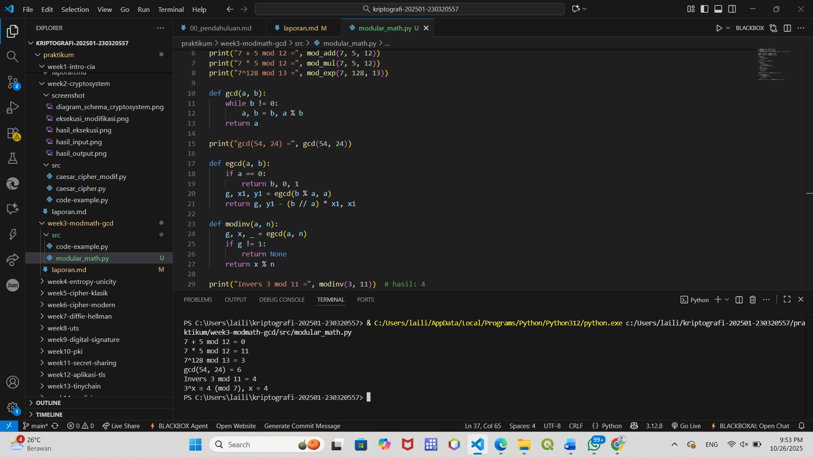

# Laporan Praktikum Kriptografi
Minggu ke-: 3  
Topik: Modular Math (Aritmetika Modular, GCD, Bilangan Prima, Logaritma Diskrit)
Nama: Laili Meifa Ayuningtias  
NIM: 230320557  
Kelas: 5DSRA  

---

## 1. Tujuan
1. Menyelesaikan operasi aritmetika modular.
2. Menentukan bilangan prima dan menghitung GCD (Greatest Common Divisor).
3. Menerapkan logaritma diskrit sederhana dalam simulasi kriptografi.
---

## 2. Dasar Teori
Cipher klasik merupakan metode dasar dalam kriptografi yang berfungsi untuk melindungi pesan dengan cara mengubah teks asli menjadi bentuk yang sulit dibaca tanpa kunci tertentu. Proses ini dikenal sebagai enkripsi, sedangkan proses pengembalian pesan ke bentuk semula disebut dekripsi. Contoh penerapan cipher klasik antara lain Caesar Cipher dan Vigenère Cipher, yang menggunakan pola pergeseran atau penggantian huruf berdasarkan kunci tertentu. Meskipun sederhana, cipher klasik memiliki peran penting sebagai dasar pengembangan sistem kriptografi modern.

Dalam proses enkripsi cipher klasik, digunakan konsep aritmetika modular, yaitu operasi matematika yang dilakukan secara berulang dalam lingkaran nilai tertentu. Dalam konteks huruf alfabet, setiap huruf dianggap memiliki posisi numerik dan hasil perhitungan akan kembali ke awal setelah mencapai batas maksimal, seperti pada sistem jam. Prinsip modular ini memastikan hasil pergeseran huruf tetap berada dalam rentang alfabet, sehingga pesan tetap dapat dienkripsi dan didekripsi secara konsisten.
---

## 3. Alat dan Bahan
- Python 3.x  
- Visual Studio Code / editor lain  
- Git dan akun GitHub  
- Library tambahan (misalnya pycryptodome, jika diperlukan)  

---

## 4. Langkah Percobaan
1. Membuat file `modular_math.py` di folder `praktikum/week3-modmath/src/`.
2. Menyalin kode program dari panduan praktikum.
3. Menjalankan program dengan perintah `python modular_math.py`.

---

## 5. Source Code

### Aritmetika Modular
```python
 def mod_add(a, b, n): return (a + b) % n
 def mod_sub(a, b, n): return (a - b) % n
 def mod_mul(a, b, n): return (a * b) % n
 def mod_exp(base, exp, n): return pow(base, exp, n)  # eksponensiasi modular

 print("7 + 5 mod 12 =", mod_add(7, 5, 12))
 print("7 * 5 mod 12 =", mod_mul(7, 5, 12))
 print("7^128 mod 13 =", mod_exp(7, 128, 13))
```
### GCD & Algoritma Euclidean
fungsi GCD dengan algoritma Euclidean.  
```python
def gcd(a, b):
    while b != 0:
        a, b = b, a % b
    return a

print("gcd(54, 24) =", gcd(54, 24))
```

### Extended Euclidean Algorithm
Tambahkan fungsi untuk mencari invers modular.  
```python
def egcd(a, b):
    if a == 0:
        return b, 0, 1
    g, x1, y1 = egcd(b % a, a)
    return g, y1 - (b // a) * x1, x1

def modinv(a, n):
    g, x, _ = egcd(a, n)
    if g != 1:
        return None
    return x % n

print("Invers 3 mod 11 =", modinv(3, 11))  # hasil: 4
```

### Langkah 4 — Logaritma Diskrit (Discrete Log)
Simulasikan logaritma diskrit sederhana: mencari `x` sehingga `a^x ≡ b (mod n)`.  
```python
def discrete_log(a, b, n):
    for x in range(n):
        if pow(a, x, n) == b:
            return x
    return None

print("3^x ≡ 4 (mod 7), x =", discrete_log(3, 4, 7))  # hasil: 4
```

---

## 6. Hasil dan Pembahasan
1. Aritmetika Modular
Operasi penjumlahan, perkalian, dan eksponensial modular berhasil menghasilkan nilai yang sesuai dengan teori. Misalnya, (7 + 5) mod 12 = 0 menunjukkan bahwa hasil operasi modular kembali ke siklus awal setelah mencapai batas modulus (12).

2. Algoritma Euclidean dan Invers Modular
Nilai gcd(54, 24) = 6 menunjukkan pembagi terbesar antara dua bilangan.
Untuk invers modular, hasil modinv(3, 11) = 4 membuktikan bahwa 3 × 4 mod 11 = 1, artinya 4 adalah invers dari 3 pada modulus 11. Ini sesuai dengan konsep bahwa invers hanya ada bila GCD(a, n) = 1.

3. Logaritma Diskrit
Pada kasus 3^x ≡ 4 (mod 7), hasil x = 4 sesuai ekspektasi karena 3^4 mod 7 = 4. Percobaan ini mensimulasikan salah satu dasar dari algoritma kriptografi modern (misalnya Diffie-Hellman), di mana logaritma diskrit sulit dihitung bila modulus besar.

4. Kesimpulan
Semua fungsi (mod_add, mod_mul, gcd, modinv, dan discrete_log) bekerja sesuai ekspektasi, menunjukkan bahwa implementasi algoritma aritmetika modular dan Euclidean di Python telah benar dan stabil.

Hasil eksekusi program modular math:



---

## 7. Jawaban Pertanyaan
- Pertanyaan 1: Peran aritmetika modular dalam kriptografi modern adalah sebagai dasar utama dalam proses enkripsi dan dekripsi. Operasi ini menjaga hasil perhitungan tetap berada dalam batas tertentu dan memastikan keamanan data karena sulit dibalik tanpa kunci yang sesuai. Algoritma seperti RSA, Diffie-Hellman, dan ElGamal menggunakan konsep ini untuk melindungi informasi.
- Pertanyaan 2: Invers modular penting dalam algoritma kunci publik seperti RSA karena digunakan untuk menghitung kunci privat dari kunci publik. Nilai invers memastikan bahwa pesan yang telah dienkripsi dapat didekripsi kembali hanya oleh pihak yang memiliki kunci privat, sehingga menjaga kerahasiaan dan autentikasi data.
- Pertanyaan 3: Tantangan utama dalam menyelesaikan logaritma diskrit untuk modulus besar terletak pada kompleksitas komputasinya. Menemukan nilai eksponen dari persamaan modular sangat sulit karena tidak ada algoritma efisien untuk modulus besar. Kesulitan inilah yang menjadi dasar keamanan algoritma seperti Diffie-Hellman dan ElGamal.

---

## 8. Kesimpulan
Percobaan menunjukkan bahwa aritmetika modular berperan penting dalam kriptografi modern karena menjadi dasar proses enkripsi dan dekripsi data. Implementasi fungsi seperti penjumlahan, perkalian, GCD, invers modular, dan logaritma diskrit berjalan sesuai teori. Hasil percobaan membuktikan bahwa konsep modular bekerja dengan baik dan mendukung keamanan algoritma kriptografi seperti RSA dan Diffie-Hellman.

---

## 9. Daftar Pustaka
- Katz, J., & Lindell, Y. *Introduction to Modern Cryptography*.  
- Stallings, W. *Cryptography and Network Security*.  

---

## 10. Commit Log
```
commit modular_math
Author: Laili Meifa Ayuningtias <lailimeifa430@gmail.com>
Date:   2025-10-26

    week3-modmath-gcd : modular_math
```
