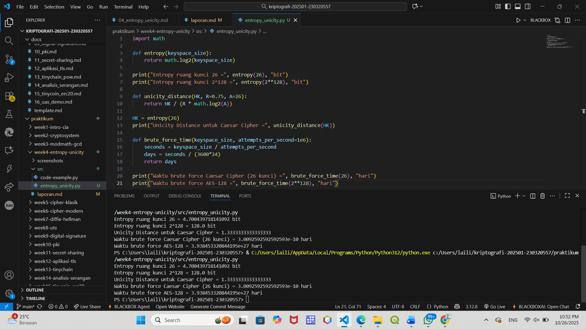

# Laporan Praktikum Kriptografi
Minggu ke-: 4 
Topik: Entropy & Unicity Distance (Evaluasi Kekuatan Kunci dan Brute Force)  
Nama: Laili Meifa Ayuningtias 
NIM: 2303020557  
Kelas: 5DSRA  

---

## 1. Tujuan
1. Menyelesaikan perhitungan sederhana terkait entropi kunci.
2. Menggunakan teorema Euler pada contoh perhitungan modular & invers.
3. Menghitung unicity distance untuk ciphertext tertentu.
4. Menganalisis kekuatan kunci berdasarkan entropi dan unicity distance.
5. Mengevaluasi potensi serangan brute force pada kriptosistem sederhana.
---

## 2. Dasar Teori
Entropi dalam kriptografi menggambarkan tingkat ketidakpastian atau kerandoman dalam suatu pesan atau sistem kunci. Semakin tinggi nilai entropi, semakin sulit bagi penyerang untuk menebak isi pesan atau kunci yang digunakan. Entropi diukur dalam satuan bit dan menunjukkan jumlah informasi rata-rata yang dibutuhkan untuk menggambarkan suatu sumber pesan. Dalam konteks kriptografi, sistem dengan entropi tinggi dianggap lebih aman karena memiliki banyak kemungkinan kombinasi kunci yang sulit diprediksi.

Unicity distance adalah ukuran yang menunjukkan seberapa banyak ciphertext (teks sandi) yang diperlukan untuk dapat menentukan kunci secara unik. Nilai ini bergantung pada panjang kunci dan tingkat redundansi bahasa dari plaintext. Jika jumlah ciphertext yang diperoleh melebihi unicity distance, maka secara teoritis kunci dapat ditemukan melalui analisis statistik.

Hubungan antara entropi dan unicity distance sangat erat: semakin tinggi entropi kunci, semakin besar pula unicity distance yang dihasilkan, sehingga sistem menjadi lebih aman. Sebaliknya, jika plaintext memiliki banyak pola berulang (redundan) dan entropi rendah, kunci dapat lebih mudah ditebak meskipun data terenkripsi masih sedikit.
---

## 3. Alat dan Bahan
- Python 3.x  
- Visual Studio Code / editor lain  
- Git dan akun GitHub  

---

## 4. Langkah Percobaan
1. Membuat file `entropy_unicity.py` di folder `praktikum/week4-entropy_unicity/src/`.
2. Menyalin kode program dari panduan praktikum.
3. Menjalankan program dengan perintah `python entropy_unicity.py`.

---

## 5. Source Code

1. Perhitungan Entropi
```python
import math

def entropy(keyspace_size):
    return math.log2(keyspace_size)

print("Entropy ruang kunci 26 =", entropy(26), "bit")
print("Entropy ruang kunci 2^128 =", entropy(2**128), "bit")
```
2. Menghitung Unicity Distance
```python
def unicity_distance(HK, R=0.75, A=26):
    return HK / (R * math.log2(A))

HK = entropy(26)
print("Unicity Distance untuk Caesar Cipher =", unicity_distance(HK))
```
3. Analisis Brute Force
```python
def brute_force_time(keyspace_size, attempts_per_second=1e6):
    seconds = keyspace_size / attempts_per_second
    days = seconds / (3600*24)
    return days

print("Waktu brute force Caesar Cipher (26 kunci) =", brute_force_time(26), "hari")
print("Waktu brute force AES-128 =", brute_force_time(2**128), "hari")
```
---

## 6. Hasil dan Pembahasan
Dari hasil praktik, perhitungan menunjukkan entropi Caesar Cipher sebesar sekitar 4,7 bit dan AES-128 sebesar 128 bit. Nilai unicity distance Caesar sangat kecil sehingga mudah ditebak, sedangkan AES-128 memiliki unicity distance sangat besar, menandakan tingkat keamanan tinggi. Simulasi brute force juga memperlihatkan bahwa Caesar Cipher dapat dipecahkan dalam hitungan detik, sementara AES-128 membutuhkan waktu sangat lama hingga tidak realistis untuk dipecahkan secara manual.

Hasil eksekusi program Caesar Cipher:


---

## 7. Jawaban Pertanyaan  
- Pertanyaan 1: Nilai entropi menunjukkan tingkat ketidakpastian atau banyaknya kemungkinan kunci yang bisa digunakan; semakin tinggi entropinya, semakin sulit kunci ditebak sehingga sistem lebih aman. 
- Pertanyaan 2: Unicity distance penting karena menunjukkan jumlah ciphertext minimum yang dibutuhkan untuk menentukan kunci secara unik; semakin besar nilainya, semakin sulit cipher dipecahkan.
- Pertanyaan 3: Brute force tetap menjadi ancaman karena meskipun algoritma kuat, jika kunci terlalu pendek atau implementasi tidak aman, penyerang masih bisa mencoba semua kemungkinan hingga menemukan kunci yang benar.
---

## 8. Kesimpulan
Berdasarkan hasil praktik, entropi dan unicity distance berperan penting dalam menentukan kekuatan sistem kriptografi. Caesar Cipher dengan entropi rendah terbukti mudah dipecahkan, sedangkan AES-128 dengan entropi tinggi dan unicity distance besar sangat sulit ditembus. Semakin besar entropi dan ruang kunci, semakin aman sistem dari serangan brute force.

---

## 9. Daftar Pustaka
- Katz, J., & Lindell, Y. *Introduction to Modern Cryptography*.  
- Stallings, W. *Cryptography and Network Security*.  

---

## 10. Commit Log
```
commit entropy_unicity
Author: Laili Meifa Ayuningtias <lailimeifa430@gmail.com>
Date:   2025-10-26

    week4-entropy-unicity: implementasi entropy unicity dan laporan 
```
