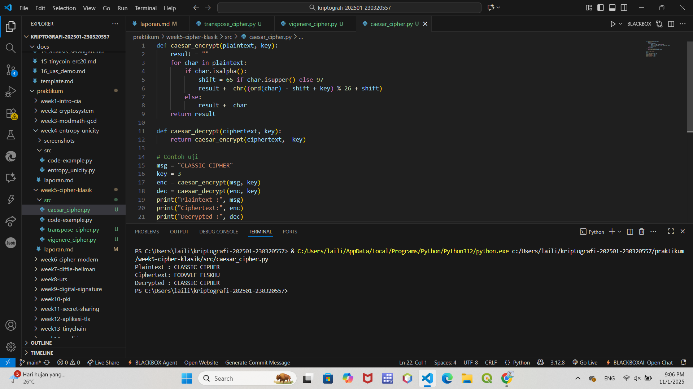
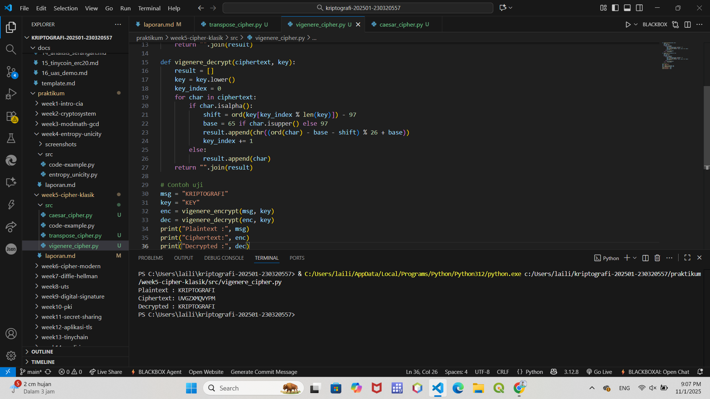
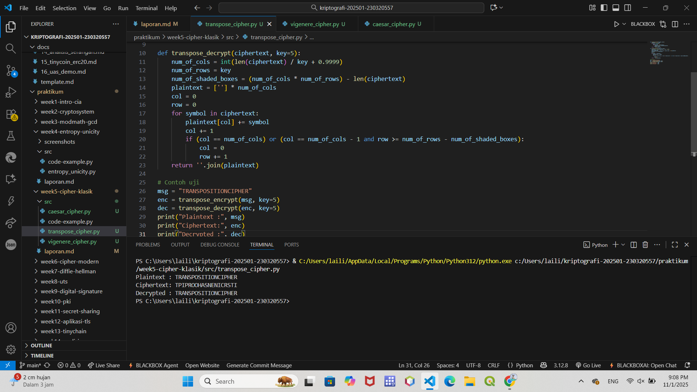

# Laporan Praktikum Kriptografi
Minggu ke-: 5  
Topik: Cipher Klasik (Caesar, Vigenère, Transposisi)  
Nama: Laili Meifa Ayuningtias
NIM: 230320557  
Kelas: 5DSRA  

---

## 1. Tujuan
1. Menerapkan algoritma Caesar Cipher untuk enkripsi dan dekripsi teks.
2. Menerapkan algoritma Vigenère Cipher dengan variasi kunci.
3. Mengimplementasikan algoritma transposisi sederhana.
4. Menjelaskan kelemahan algoritma kriptografi klasik.

---

## 2. Dasar Teori
Cipher klasik adalah metode penyandian pesan yang digunakan pada masa sebelum adanya komputer modern. Tujuannya adalah mengubah plaintext menjadi ciphertext agar pesan tidak dapat dibaca oleh pihak lain. Teknik ini pada dasarnya terbagi menjadi dua jenis, yaitu cipher substitusi yang mengganti setiap huruf dengan huruf lain, dan cipher transposisi yang mengubah posisi huruf tanpa mengubah bentuk hurufnya. Contoh cipher substitusi antara lain Caesar Cipher dan Vigenère Cipher, sedangkan contoh cipher transposisi adalah Rail Fence Cipher dan Columnar Transposition.

Meskipun sederhana dan mudah diterapkan, cipher klasik memiliki kelemahan utama dalam hal keamanan. Pola bahasa asli masih sering terlihat pada ciphertext, sehingga memungkinkan dilakukannya analisis frekuensi untuk memecahkan pesan. Selain itu, ruang kunci pada cipher klasik relatif kecil, sehingga serangan brute force dapat dilakukan dengan cepat menggunakan komputer modern.

Oleh karena kelemahan tersebut, cipher klasik tidak lagi dianggap aman untuk digunakan dalam sistem komunikasi dan keamanan informasi masa kini. Perkembangan teknologi kriptografi kemudian menghasilkan algoritma cipher modern seperti AES, RSA, dan ECC yang memiliki struktur matematis lebih kompleks dan tingkat keamanan yang jauh lebih tinggi. Namun demikian, cipher klasik tetap penting sebagai dasar teori dalam mempelajari kriptografi.

---

## 3. Alat dan Bahan
- Python 3.x  
- Visual Studio Code / editor lain  
- Git dan akun GitHub  
- Library tambahan (misalnya pycryptodome, jika diperlukan)  

---

## 4. Langkah Percobaan
1. Membuat file `caesar_cipher.py` dan lainnya di folder `praktikum/week5-cryptosystem/src/`.
2. Menyalin kode program dari panduan praktikum.
3. Menjalankan program dengan perintah `python caesar_cipher.py`.

---

## 5. Source Code

```python
# Implementasi Caesar Cipher
def caesar_encrypt(plaintext, key):
    result = ""
    for char in plaintext:
        if char.isalpha():
            shift = 65 if char.isupper() else 97
            result += chr((ord(char) - shift + key) % 26 + shift)
        else:
            result += char
    return result

def caesar_decrypt(ciphertext, key):
    return caesar_encrypt(ciphertext, -key)

# Contoh uji
msg = "CLASSIC CIPHER"
key = 3
enc = caesar_encrypt(msg, key)
dec = caesar_decrypt(enc, key)
print("Plaintext :", msg)
print("Ciphertext:", enc)
print("Decrypted :", dec)
```
```python
# Implementasi Vigenère Cipher
def vigenere_encrypt(plaintext, key):
    result = []
    key = key.lower()
    key_index = 0
    for char in plaintext:
        if char.isalpha():
            shift = ord(key[key_index % len(key)]) - 97
            base = 65 if char.isupper() else 97
            result.append(chr((ord(char) - base + shift) % 26 + base))
            key_index += 1
        else:
            result.append(char)
    return "".join(result)

def vigenere_decrypt(ciphertext, key):
    result = []
    key = key.lower()
    key_index = 0
    for char in ciphertext:
        if char.isalpha():
            shift = ord(key[key_index % len(key)]) - 97
            base = 65 if char.isupper() else 97
            result.append(chr((ord(char) - base - shift) % 26 + base))
            key_index += 1
        else:
            result.append(char)
    return "".join(result)

# Contoh uji
msg = "KRIPTOGRAFI"
key = "KEY"
enc = vigenere_encrypt(msg, key)
dec = vigenere_decrypt(enc, key)
print("Plaintext :", msg)
print("Ciphertext:", enc)
print("Decrypted :", dec)
```
```python
# Implementasi Transpose Cipher
def transpose_encrypt(plaintext, key=5):
    ciphertext = [''] * key
    for col in range(key):
        pointer = col
        while pointer < len(plaintext):
            ciphertext[col] += plaintext[pointer]
            pointer += key
    return ''.join(ciphertext)

def transpose_decrypt(ciphertext, key=5):
    num_of_cols = int(len(ciphertext) / key + 0.9999)
    num_of_rows = key
    num_of_shaded_boxes = (num_of_cols * num_of_rows) - len(ciphertext)
    plaintext = [''] * num_of_cols
    col = 0
    row = 0
    for symbol in ciphertext:
        plaintext[col] += symbol
        col += 1
        if (col == num_of_cols) or (col == num_of_cols - 1 and row >= num_of_rows - num_of_shaded_boxes):
            col = 0
            row += 1
    return ''.join(plaintext)

# Contoh uji
msg = "TRANSPOSITIONCIPHER"
enc = transpose_encrypt(msg, key=5)
dec = transpose_decrypt(enc, key=5)
print("Plaintext :", msg)
print("Ciphertext:", enc)
print("Decrypted :", dec)
```
---

## 6. Hasil dan Pembahasan
Hasil uji menunjukkan bahwa ketiga algoritma, yaitu Caesar Cipher, Vigenère Cipher, dan Transposition Cipher, berhasil melakukan proses enkripsi dan dekripsi dengan benar sehingga pesan dapat kembali ke bentuk aslinya. Setiap algoritma dapat menyembunyikan teks, namun pola huruf masih dapat dianalisis sehingga keamanannya tergolong rendah. Dengan demikian, cipher klasik hanya sesuai untuk pembelajaran dasar kriptografi, bukan untuk keamanan modern.

Hasil eksekusi program :





---

## 7. Jawaban Pertanyaan
- Pertanyaan 1: Kelemahan utama algoritma Caesar Cipher dan Vigenère Cipher
Kelemahan utama Caesar Cipher adalah ruang kuncinya sangat kecil sehingga dapat dengan mudah dipecahkan dengan brute force. Sementara itu, Vigenère Cipher meskipun lebih kuat, tetap memiliki kelemahan jika panjang kunci dapat ditebak atau pola kunci berulang, sehingga memungkinkan serangan analisis frekuensi lanjutan seperti Kasiski Attack. Dengan kata lain, keduanya masih meninggalkan pola bahasa yang dapat dimanfaatkan penyerang.

2- Pertanyaan 2: Alasan cipher klasik mudah diserang dengan analisis frekuensi
Cipher klasik mudah diserang dengan analisis frekuensi karena pola kemunculan huruf dalam ciphertext masih menyerupai pola huruf dalam plaintext. Bahasa alami seperti bahasa Indonesia atau Inggris memiliki karakteristik frekuensi huruf tertentu yang tetap konsisten. Ketika cipher hanya mengganti huruf tetapi tidak mengubah distribusi frekuensinya, penyerang dapat membandingkan pola tersebut dan memetakan kembali huruf-huruf ke pesan asli.

- Pertanyaan 3:Perbandingan cipher substitusi vs transposisi
Cipher substitusi mengganti setiap huruf dengan huruf lain sehingga bentuk huruf berubah tetapi pola posisinya tetap, sedangkan cipher transposisi mempertahankan huruf asli namun mengubah susunan atau urutannya. Kelebihan cipher substitusi adalah lebih mudah diterapkan, tetapi kelemahannya frekuensi huruf tetap terlihat jelas. Sementara itu, cipher transposisi dapat mengaburkan pola posisi huruf, namun jika struktur kalimat panjang masih bisa dianalisis, sehingga keduanya tetap tidak cukup aman untuk penggunaan modern.

 
---

## 8. Kesimpulan
Penerapan Caesar Cipher, Vigenère Cipher, dan Transposition Cipher berhasil menunjukkan cara kerja dasar enkripsi dan dekripsi pada kriptografi klasik. Meskipun ketiganya dapat menyembunyikan pesan, pola bahasa pada ciphertext masih dapat dianalisis sehingga tingkat keamanannya rendah. Oleh karena itu, cipher klasik lebih cocok digunakan untuk tujuan pembelajaran daripada keamanan komunikasi modern.

---

## 9. Daftar Pustaka  
- Katz, J., & Lindell, Y. *Introduction to Modern Cryptography*.  
- Stallings, W. *Cryptography and Network Security*.

---

## 10. Commit Log

```
commit cipher-klasik
Author: Laili Meifa Ayuningtias <lailimeifa430@gmail.com>
Date:   2025-11-01

    week5-cipher-klasik: implementasi Cipher Klasik dan laporan 
```
