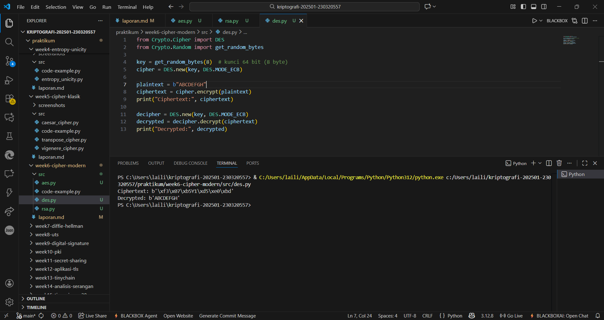
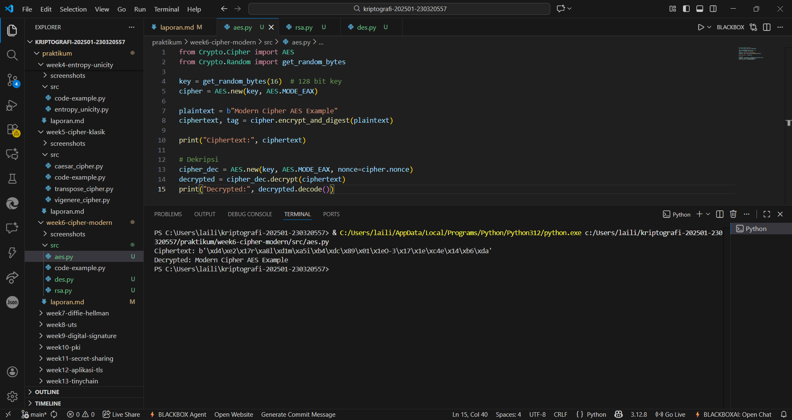
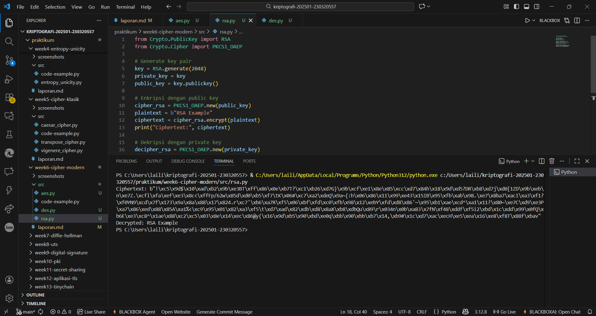

# Laporan Praktikum Kriptografi
Minggu ke-: 6  
Topik: Cipher Modern (DES, AES, RSA) 
Nama: Laili Meifa Ayuningtias 
NIM: 230320557  
Kelas: 5DSRA

---

## 1. Tujuan
1. Mengimplementasikan algoritma DES untuk blok data sederhana.
2. Menerapkan algoritma AES dengan panjang kunci 128 bit.
3. Menjelaskan proses pembangkitan kunci publik dan privat pada algoritma RSA.

---

## 2. Dasar Teori
Cipher modern seperti DES, AES, dan RSA digunakan untuk menjaga kerahasiaan data dengan pendekatan yang berbeda. DES dan AES termasuk ke dalam algoritma simetris, yaitu menggunakan kunci yang sama untuk proses enkripsi dan dekripsi. DES bekerja pada blok 64 bit dengan kunci 56 bit, namun saat ini dianggap tidak aman karena ukuran kuncinya kecil dan mudah diretas. Sebagai penggantinya, AES menjadi standar enkripsi modern yang lebih kuat, bekerja pada blok 128 bit dengan panjang kunci 128, 192, atau 256 bit, serta memiliki proses transformasi data yang lebih kompleks sehingga sangat sulit dipecahkan.

Sementara itu, RSA termasuk ke dalam algoritma asimetris, artinya menggunakan dua kunci berbeda yaitu public key untuk enkripsi dan private key untuk dekripsi. RSA didasarkan pada konsep matematika bilangan prima besar dan sulitnya melakukan faktorisasi, sehingga cocok digunakan untuk keamanan pertukaran kunci dan tanda tangan digital, bukan untuk enkripsi data dalam jumlah besar karena prosesnya relatif lambat. Secara keseluruhan, AES biasanya digunakan untuk enkripsi data utama, sementara RSA digunakan untuk mengamankan kunci enkripsi tersebut.


---

## 3. Alat dan Bahan
- Python 3.x  
- Visual Studio Code / editor lain  
- Git dan akun GitHub  
- Library tambahan (misalnya pycryptodome, jika diperlukan)  

---

## 4. Langkah Percobaan
1. Mengimplementasikan DES (Opsional, Simulasi) ke dalam program python.
2. Mengimplementasikan AES-128 ke dalam program python.
3. Mengimplementasikan RSA ke dalam program python.
4. Menjawab pertanyaan diskusi.
5. Membuat laporan.md yang berisi ringkasan teori tentang algoritma modern.

---

## 5. Source Code

DES
```python
from Crypto.Cipher import DES
from Crypto.Random import get_random_bytes

key = get_random_bytes(8)  # kunci 64 bit (8 byte)
cipher = DES.new(key, DES.MODE_ECB)

plaintext = b"ABCDEFGH"
ciphertext = cipher.encrypt(plaintext)
print("Ciphertext:", ciphertext)

decipher = DES.new(key, DES.MODE_ECB)
decrypted = decipher.decrypt(ciphertext)
print("Decrypted:", decrypted)
```

AES
```python
from Crypto.Cipher import AES
from Crypto.Random import get_random_bytes

key = get_random_bytes(16)  # 128 bit key
cipher = AES.new(key, AES.MODE_EAX)

plaintext = b"Modern Cipher AES Example"
ciphertext, tag = cipher.encrypt_and_digest(plaintext)

print("Ciphertext:", ciphertext)

# Dekripsi
cipher_dec = AES.new(key, AES.MODE_EAX, nonce=cipher.nonce)
decrypted = cipher_dec.decrypt(ciphertext)
print("Decrypted:", decrypted.decode())
```

RSA
```python
from Crypto.PublicKey import RSA
from Crypto.Cipher import PKCS1_OAEP

# Generate key pair
key = RSA.generate(2048)
private_key = key
public_key = key.publickey()

# Enkripsi dengan public key
cipher_rsa = PKCS1_OAEP.new(public_key)
plaintext = b"RSA Example"
ciphertext = cipher_rsa.encrypt(plaintext)
print("Ciphertext:", ciphertext)

# Dekripsi dengan private key
decipher_rsa = PKCS1_OAEP.new(private_key)
decrypted = decipher_rsa.decrypt(ciphertext)
print("Decrypted:", decrypted.decode())
```
---

## 6. Hasil dan Pembahasan
Hasil eksekusi menunjukkan bahwa proses enkripsi dan dekripsi berhasil dilakukan untuk ketiga algoritma. Data yang terenkripsi berubah menjadi bentuk biner tidak terbaca, dan setelah didekripsi menghasilkan kembali plaintext asli. 





---

## 7. Jawaban Pertanyaan  
- Pertanyaan 1: Apa perbedaan mendasar antara DES, AES, dan RSA dalam hal kunci dan keamanan? DES dan AES menggunakan kunci simetris, tetapi DES memiliki kunci 56-bit yang lemah, sedangkan AES memiliki kunci 128/192/256-bit yang jauh lebih aman; RSA menggunakan pasangan kunci public–private sehingga lebih aman untuk pertukaran kunci.  
- Pertanyaan 2: Mengapa AES lebih banyak digunakan dibanding DES di era modern? AES lebih digunakan karena jauh lebih kuat, lebih cepat, dan memiliki ukuran kunci besar yang tidak mudah diretas, sedangkan DES sudah tidak aman.
- Pertanyaan 3: Mengapa RSA dikategorikan sebagai algoritma asimetris, dan bagaimana proses pembangkitan kuncinya? RSA asimetris karena memakai dua kunci berbeda (public dan private), dan kuncinya dibangkitkan dengan memilih dua bilangan prima besar lalu digunakan untuk membentuk pasangan kunci tersebut.  

---

## 8. Kesimpulan
Berdasarkan percobaan, ketiga algoritma berhasil mengamankan data dengan pendekatan yang berbeda sesuai karakteristiknya. AES terbukti paling efisien dan kuat untuk enkripsi data utama, sedangkan RSA lebih cocok digunakan untuk pertukaran kunci karena sifatnya yang asimetris. DES dapat berjalan dengan benar, namun sudah tidak direkomendasikan karena kelemahannya dalam keamanan.

---

## 9. Daftar Pustaka  
- Katz, J., & Lindell, Y. *Introduction to Modern Cryptography*.  
- Stallings, W. *Cryptography and Network Security*. 

---

## 10. Commit Log
```
commit week6-cipher-modern
Author: Laili Meifa Ayuningtias <lailimeifa430@gmail.com>
Date:   2025-11-14

    week6-cipher-modern: implementasin dan laporan Cipher Modern
```
