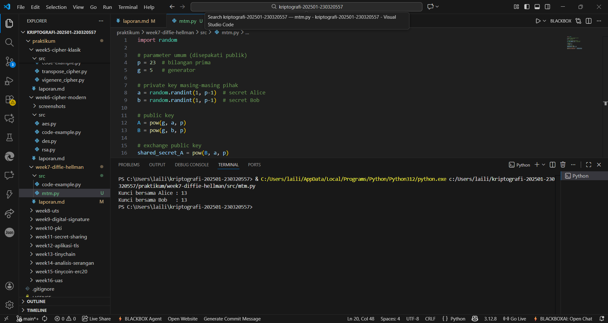

# Laporan Praktikum Kriptografi
Minggu ke-: 7  
Topik: Diffie-Hellman Key Exchange  
Nama: Laili Meifa Ayuningtias  
NIM: 230320557  
Kelas: 5DSRA  

---

## 1. Tujuan
1. Melakukan simulasi protokol Diffie-Hellman untuk pertukaran kunci publik.
2. Menjelaskan mekanisme pertukaran kunci rahasia menggunakan bilangan prima dan logaritma diskrit.
3. Menganalisis potensi serangan pada protokol Diffie-Hellman (termasuk serangan Man-in-the-Middle / MITM).

---

## 2. Dasar Teori

Percobaan enkripsi menggunakan DES, AES, dan RSA menunjukkan bahwa ketiga algoritma dapat mengenkripsi dan mendekripsi data dengan benar sesuai mekanisme masing-masing. DES beroperasi dengan cepat namun sudah tidak aman karena panjang kunci 56-bit sangat mudah diretas menggunakan serangan brute force modern. AES bekerja lebih efisien dan aman dengan kunci 128 bit, sementara RSA berhasil menghasilkan pasangan kunci public–private dan menjalankan enkripsi asimetris yang cocok untuk pertukaran kunci, bukan untuk enkripsi data besar.

DES memiliki kelemahan utama pada ukuran kunci yang pendek sehingga sangat rentan terhadap brute force dan serangan analisis kriptografi modern. AES jauh lebih kuat, namun tetap memiliki potensi risiko jika implementasi salah, seperti penggunaan mode enkripsi yang lemah, kesalahan pengelolaan kunci, atau serangan side-channel pada perangkat keras. RSA meski aman secara matematis, dapat diserang jika bilangan prima yang digunakan terlalu kecil, terjadi kebocoran private key, atau melalui serangan side-channel seperti timing attack dan fault injection.

Cipher simetris seperti DES dan AES menggunakan satu kunci yang sama untuk enkripsi dan dekripsi, sehingga bergantung pada kerahasiaan kunci dan kekuatan ukuran kuncinya. DES menjadi tidak aman karena panjang kuncinya terlalu kecil dibanding kemampuan komputasi saat ini, sementara AES menjadi standar modern karena struktur dan ukuran kuncinya yang jauh lebih kuat. RSA sebagai cipher asimetris mengandalkan dua kunci berbeda yang dibangkitkan dari bilangan prima besar, dan keamanannya bergantung pada kesulitan faktorisasi sehingga cocok untuk pertukaran kunci dan tanda tangan digital.


---

## 3. Alat dan Bahan
- Python 3.x  
- Visual Studio Code / editor lain  
- Git dan akun GitHub  

---

## 4. Langkah Percobaan
1. Implementasi diffie-hellman pada program python
2. Melakukan simulasi serangan MITM (Man-in-the-middle)
3. Menjawab pertanyaan diskusi
4. Membuat laporan.md

---

## 5. Source Code

```python
import random

# parameter umum (disepakati publik)
p = 23  # bilangan prima
g = 5   # generator

# private key masing-masing pihak
a = random.randint(1, p-1)  # secret Alice
b = random.randint(1, p-1)  # secret Bob

# public key
A = pow(g, a, p)
B = pow(g, b, p)

# exchange public key
shared_secret_A = pow(B, a, p)
shared_secret_B = pow(A, b, p)

print("Kunci bersama Alice :", shared_secret_A)
print("Kunci bersama Bob   :", shared_secret_B)
```

---

## 6. Hasil dan Pembahasan


---

## 7. Jawaban Pertanyaan 
- Pertanyaan 1: Mengapa Diffie-Hellman memungkinkan pertukaran kunci di saluran publik? Diffie-Hellman memungkinkan pertukaran kunci di saluran publik karena kedua pihak dapat menghitung kunci bersama tanpa pernah mengirimkan kunci tersebut secara langsung.
- Pertanyaan 2: Apa kelemahan utama protokol Diffie-Hellman murni? Kelemahan utamanya adalah rentan terhadap serangan Man-in-the-Middle (MITM) karena tidak ada mekanisme autentikasi.
3. Bagaimana cara mencegah serangan MITM pada protokol ini? Serangan MITM dapat dicegah dengan menambahkan autentikasi, misalnya menggunakan tanda tangan digital, sertifikat (PKI), atau menggabungkan Diffie-Hellman dengan RSA atau algoritma autentikasi lainnya.
---

## 8. Kesimpulan
Diffie-Hellman adalah protokol kriptografi yang memungkinkan dua pihak membentuk kunci rahasia bersama melalui saluran publik dengan memanfaatkan bilangan prima dan prinsip logaritma diskrit. Keamanan protokol ini bergantung pada sulitnya menghitung kunci rahasia dari kunci publik, namun tanpa autentikasi tambahan Diffie-Hellman tetap rentan terhadap serangan Man-in-the-Middle.

---

## 9. Daftar Pustaka
- Katz, J., & Lindell, Y. *Introduction to Modern Cryptography*.  
- Stallings, W. *Cryptography and Network Security*.  

---

## 10. Commit Log
```
commit week7-diffie-hellman
Author: laili meifa ayuningtias <lailimeifa430@gmail.com>
Date:   2025-11-19

    week7-diffie-hellman: implementasi  dan laporan Diffie-Hellman Key Exchange
```
